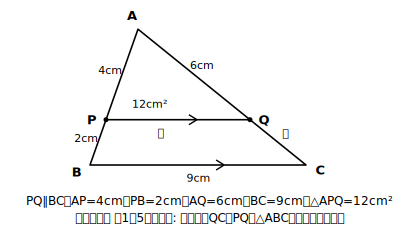

# L17 章末まとめ — この章を1枚の地図にする

## ねらい

- 相似の章で学んだことを「意味→条件→証明→線分の比→計量→利用」の**1本の線**として振り返る。
- 各まとまりの代表問題を1問ずつ、**1つの図**の上で解き直し、章全体が繋がっていることを確かめる。

## 主概念1（統合）：単元の構造マップ——6つのまとまりは1本の線

この章は、バラバラな6つの話ではない。**前のまとまりが次のまとまりの道具になる**、1本の線だった。（この6つは学んだ中身の区切りで、教科書やレッスンマップの正式な節割り「1節〜4節＋章末」とは別の分け方だ。）

| まとまり | 学んだこと | 次への渡し物 |
|---|---|---|
| 意味（L01-02） | 相似の定義・記号∽・相似比 | 「対応する」線分の比という見方 |
| 条件（L03） | 三角形の相似条件3つ（合同条件と対比） | 相似だと**示す**ための道具 |
| 証明（L04-05） | 構想→記述の2段階・循環論法セルフチェック | 相似を**根拠つきで**使う資格 |
| 線分の比（L06-11） | 平行線と線分の比・中点連結定理（特別な場合） | 平行から比を取り出す技 |
| 計量（L12-14） | 面積比=相似比の2乗・体積比=3乗 | 長さの比から面積・体積へ |
| 利用（L15-16） | 縮図測量の3手順・誤差の見積もり | 現実の場面で使い切る力 |

定義があるから条件が言え、条件があるから証明でき、証明できるから比や面積比を**根拠つきで**使える。使えるから、木の高さのような現実の問題に届く。どこか1つが抜けると、その先が全部「そういうものだから」に戻ってしまう。

:::guide
**まとめ回の使い方：時間はいちばん苦しいところに注ぐ**

まとめ回は「全部を薄くおさらいする時間」にすると、いちばん効き目が薄くなる。1時間しかないなら、配分に濃淡をつけよう。おすすめは、構造マップの表を（できれば見ずに）自分で埋め直すのに最初の10分、統合演習の問1〜5に30分弱——**そのうち一番厚く時間を割くのは問3の証明**だ。証明は、この章で最も差がつきやすく、次章以降も使い続ける型だからである。書き出せないときは、いきなり書こうとせず「何がいえればよいか」を口に出して言ってから書く（L04の構想）。口で言えれば、あとは文章に直すだけだ。
:::

:::guide
**つまずきやすい場所は、章の中で均等ではない**

この章を通しての実感とも合うはずだが、つまずきは「条件を当てはめて計算する」場面より、**証明を記述する場面**と**現実の場面から相似を見つけて使う場面**（測量・活用）に集中しやすい。だからこの教材は、証明に2レッスン＋3点検の型を、測量に3手順の型を、それぞれ重点的に配置してきた。統合演習で問3（証明）と問6（利用）に他より時間がかかったとしても、それは順調な証拠——難所に時間がかかるのは当然で、型（構想→記述→3点検／3手順）に戻れば必ず進める。どの型に戻ればよいかが自分で言えることが、この章の仕上がりの目安だ。
:::

## 主概念2（統合）：根拠リストが育った

中2の証明で使えた根拠は、対頂角・平行線の性質・合同条件などだった。この章で、そのリストに**相似条件と相似な図形の性質**が加わった。証明の書き方・構想の立て方・循環論法セルフチェック（結論の印付け→根拠の照合→循環の検査、の3点検）は中2と同じ型のまま、**使える根拠だけが増えた**。次の章（円）でも、このリストはさらに育つ。

## 統合演習：1つの図で章を歩き直す

**図の設定**: △ABCの辺AB上に点P、辺AC上に点Qがあり、PQ∥BC。AP=4cm、PB=2cm、AQ=6cm、BC=9cm、△APQの面積は12cm²とする。

**問1（意味）** △APQと△ABCは相似である。記号∽を使って対応する頂点の順に書き、相似比を求めよう。

**問2（条件）** 問1の2つの三角形が相似であることを示すには、3つの相似条件のうちどれが使えるか。使う条件を「対応する」つきの文言で答えよう。

**問3（証明）** △APQ∽△ABCを証明しよう。書き終えたら、L05の**循環論法セルフチェック（3点検）** を実行すること——とくに「△APQ∽△ABCだから角が等しい」を根拠に書いていないか（それは結論そのものだ）。

**問4（線分の比）** QCの長さと、PQの長さを求めよう。

**問5（計量）** △ABCの面積を求めよう。求めたら、**答えが相似比の2乗倍になっているか**を検算しよう（L12の習慣）。

**問6（利用）** 縮尺1/250の縮図で、ビルの高さにあたる線分の長さが4.8cmだった。実際の高さは何mか。また、この答えに「約」をつけるべき理由をL16の言葉で1つ挙げよう。

（解答は指導者用answer_key_L17に分離）

## 振り返りの問い（ノートに1行ずつ）

1. この章で「いちばん予想と違ったこと」は何か（L12の予想メモを見返してよい）。
2. 中2の証明と比べて、増えたものは何で、変わらなかったものは何か。
3. 構造マップの6つのまとまりのうち、次の章でも使いそうだと思うものを1つ選び、理由を書こう。

:::zatsudan
## 雑談枠：定義の言い換えでつながる数学

中2の合同は「移動して**重なる**」、この章の相似は「拡大または縮小したときに**合同になる**」——つまり相似の定義の中に、合同がまるごと入っている。実際、相似比が1:1のとき、相似はちょうど合同になる。君のノートの1年分は、こうやって上書きではなく**入れ子**で育っている。次の章の円でも、この章の相似が中に入り込んでくる。
:::

:::stretch
## stretch（発展・分離枠）

- 統合演習の図で、PQ∥BCのまま点PをAB上で動かすと、問1〜5の答えのうち「変わるもの」と「変わらないもの」はどれか。理由をつけて整理してみよう。
- この章の構造マップ（6つのまとまりの表）を、自分の言葉で1枚の図にかき直してみよう。矢印に「なぜ次に繋がるのか」を一言ずつ添えること。
:::

---

対応解答: answer_key_L17.md

<!-- gen_nav:nav:start（自動生成・手編集しない） -->

---

[← 前のレッスン](lesson_16.md)｜[単元の目次](README.md)｜[解答](answer_key_L17.md)

<!-- gen_nav:nav:end -->
