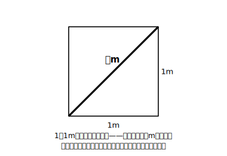

# L01 新しい数が必要になるとき——平方根と√

## ねらい

- 「有理数では表すことのできない量」が実際に存在することを、正方形の対角線で体感する。
- **aの平方根**の定義（2乗するとaになる数）と、記号**√**の意味を理解する。正の数の平方根は正と負の**2つ**あること、√aはその**正の方**を表すこと、0の平方根は0であることを使えるようになる。

## 準備運動：道具箱の点検（前提診断）

新しい章に入る前に、次の5問をやってみよう。すらすら解ければ準備は万全。あやしいところが見つかったら、それだけで収穫だ。

1. 次を計算しよう。 5²、(−5)²、0.4²
2. 次を計算しよう。 (2/3)²
3. 2乗すると9になる数を**すべて**書こう。
4. 72を素因数分解しよう。
5. 面積が25cm²の正方形の1辺の長さは何cmだろう。

3で「3だけ」と答えた人は、(−3)²＝9 も思い出しておこう。**「2乗すると9になる数」は2つある**——この事実が、この章の主役の定義にそのまま効いてくる。4の素因数分解は、この章の後半（L06）で意外な再登場をする。

## 主概念1：ものさしで測れないのに、確かにそこにある長さ

1辺が1mの正方形を思いうかべてほしい。その対角線の長さは何mだろうか。

対角線は目の前に確かに引ける。長さも確かに決まっている。ところが、この長さは 1.4 でも 1.41 でも 1.414 でもない——どれも2乗すると2にわずかに届かないか、わずかに超える（このことはL02でとことん確かめる）。実は、この長さは**分数（整数の比）では表すことができない**ことが知られている。

小学校以来、わたしたちは数の世界を広げてきた。中1では0より小さい数（負の数）まで広げた。それでも、**目の前にある対角線の長さを言い表す数が、まだ手もとにない**。ならばどうするか——数の世界をもう一度広げればいい。中1の負の数が「数の拡張の第1幕」だったとすれば、この章は**第2幕**だ。

:::guide
**「表せない」と言われても、ピンとこなくて当然**

「対角線の長さが分数で表せない」は、この段階では証明抜きの予告だ。ここで完全に納得できなくてよい。大事なのは「測れば必ずどこかの目盛りに当たるはずでは？」という健全な違和感を持つこと。その違和感こそ、数の世界を広げる原動力になる。なぜ分数で表せないのかの説明は高校で本格的に学ぶが、気になる人は「ルート2 分数で表せない 理由」で調べてみると、中3でも読める背理法の説明が見つかる（L11のstretchでも入り口だけ紹介する）。
:::

## 主概念2：平方根——「2乗する」の逆をたどる

対角線の長さを x mとすると、この正方形の性質から **x²＝2** が成り立つ（このことは後の三平方の定理の章でも確かめられる。いまは「2乗すると2になる長さ」と受け取ってよい）。

つまり、いま必要なのは「**2乗するとaになる数**」を求めることだ。「2乗する」計算の**逆向き**の操作である。この数に名前を付けよう。

> **x²＝a（a＞0）を成り立たせるxの値を、aの平方根という。**

準備運動の3で確かめたとおり、2乗して9になる数は 3 と −3 の2つあった。同じように、

- **正の数aの平方根は、正のものと負のものの2つ**ある。
- **0の平方根は0**だけである（2乗して0になる数は0しかない）。

たとえば、16の平方根は 4 と −4。0.25の平方根は 0.5 と −0.5。4/9の平方根は 2/3 と −2/3。ここまでは、いままでの数で答えられる。

では、**2の平方根**は？ 2乗して2になる数は、整数にも分数にも見つからない。そこで新しい記号の出番になる。

## 主概念3：√——新しい数に付けた「名前」

円の学習を思い出そう。円周率 3.14159… は、どこまで書いても書き終わらない。だからわたしたちは **π** という1文字でこの数を表した。それとまったく同じ発想で、

> **正の数aの2つの平方根のうち、正の方を √a と書き、負の方を −√a と書く。**

記号√を**根号**という。「2の平方根」のうち正の方は √2、負の方は −√2 だ。定義から、次がいつでも成り立つ。

(√a)²＝a、 (−√a)²＝a

ここで、ひとつ正直に向き合っておきたいことがある。「√2は2乗すると2になる数です」と聞くと、**「それは問いをくり返しただけで、答えになっていないのでは？」** と感じないだろうか。その感覚は鋭い。

でも、πのときを思い出してほしい。「πは円周と直径の比です」も、値そのものを言ってはいない。それでもわたしたちはπを**1つの決まった数**として堂々と使い、必要なら3.14という近似値に直してきた。√2も同じだ。**√2は「答えの代わりの記号」ではなく、確かに存在する1つの数に付けた正式な名前**であり、必要ならいつでも近似値（およそ1.41）に直せる。名前を付けただけではない——1辺1mの正方形の対角線として、この長さは目の前に**実在する**（この長さがたしかに x²＝2 を満たすことのきちんとした確かめは、三平方の定理の章で行う）。その「およそいくつなのか」を自分の手で確かめるのが、次のL02だ。

:::zatsudan
πと√、実は同じ発想の発明なんだ。円周率3.14…を毎回書くのは大変だから、たった1文字のπで表すことにした。√も同じで、「2乗すると2になる、あの数」をいちいち言葉で説明する代わりに√2と書く。数学の記号って、突きつめると「長い話を短く書きたい！」という、ちょっと横着な（でも強力な）願いから生まれているのかもしれないね。
:::

## 使い分けの整理：「9の平方根」と「√9」

まぎらわしい言い方を、ここで正面から整理しておく。

- **9の平方根**は？ → 2乗して9になる数のことだから、**3と−3**（2つ）。
- **√9**は？ → 9の平方根のうち**正の方**だから、**3**（1つ）。√9＝3 であって、√9 という書き方のまま残す必要はない。

「平方根」と聞かれたら2つ、「√」と書かれたら正の方1つ。この区別は章全体で効き続ける。

:::guide
**√4＝±2 と書いてしまう間違いをどう防ぐか**

上の整理を自分の言葉で言い直すと、「平方根＝**集まりの呼び名**（2つある）」「√＝**そのうち正の方1つを指す記号**」となる。混同しやすいのは「√の中が平方数のとき」だ。√4 を見たら、まず「4の平方根のうち正の方」と読み下し、2乗して4になる正の数＝2、と答える。逆に「4の平方根を求めよ」なら ±2（2と−2をまとめた書き方）。**問いが「平方根」という言葉か「√」という記号か**——そこだけ見れば確実に区別できる。
:::

:::guide
**なぜ「正の方」に専用記号を与えるのか**

2つある平方根のうち正の方にだけ√という記号を用意するのは、ひいきではなく実用上の設計だ。長さ・面積など、この章で√を使いたい場面の多くは正の量を扱う。そこで「正の方」を基準として √a と決めておけば、負の方は −√a と機械的に書けて、2つセットなら ±√a とまとめられる。「基準を1つ決めて、残りは符号で表す」——中1で数直線の右向きを正と決めたときと同じ発想である。
:::

## 練習

1. 次の数の平方根を求めよう。
   (1) 36　(2) 5　(3) 0.09　(4) 25/49
2. 次の値を求めよう。
   (1) √64　(2) −√100　(3) √(9/16)　(4) (√7)²　(5) (−√7)²
3. 次の文が正しければ○を、正しくなければ×を付けて正しく直そう。
   (1) 7の平方根は√7である。
   (2) √49＝7 である。
   (3) −√2 は「2乗すると−2になる数」である。
4. 面積が11cm²の正方形の1辺の長さを、√を使って表そう。

:::stretch
**S1** 「−4の平方根」は、いままでの数（中3までに学ぶ数）の中には存在しない。その理由を「2乗」という言葉を使って説明してみよう。（ヒント: 正の数を2乗すると？ 負の数を2乗すると？ 0を2乗すると？）

（数の世界はこの先、高校でさらにもう一幕広がる。「2乗すると負になる数」を人類がどう扱ったか、気になる人は「虚数 とは」で調べてみよう——ただしこの章の試験範囲では「存在しない」が正解だ。）
:::

---

対応解答: answer_key_L01-04.md

<!-- gen_nav:nav:start（自動生成・手編集しない） -->

---

[単元の目次](README.md)｜[解答](answer_key_L01-04.md)｜[次のレッスン →](lesson_02.md)

<!-- gen_nav:nav:end -->
