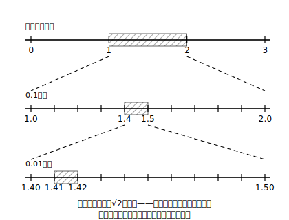
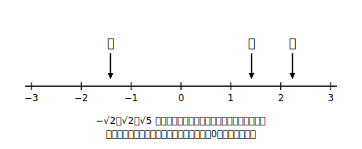

# L02 √の大きさを体でつかむ——数直線と挟み撃ち

## ねらい

- √2が「およそいくつ」なのかを、**自分の手で**追い詰められるようになる（挟み撃ちの逐次近似）。
- √の付いた数を数直線の上に置き、「どの整数とどの整数の間か」を言えるようになる。
- 1.41…は√2の**近似値**であって√2そのものではない、という区別を身に付ける。

## 導入：√2に「顔」を与えよう

L01で、√2は「確かに存在する1つの数の名前」だと約束した。でも、名前だけ知っていて顔を知らない相手とは、なかなか仲良くなれない。√2はいったい、どのくらいの大きさの数なのだろう？ 今日は電卓（スマホの電卓機能で十分。√キーはまだ使わない）を用意して、√2の正体に自力で迫る。

## 主概念1：挟み撃ち——2乗して2に迫る

√2は「2乗すると2になる正の数」だった。だから、**いろいろな数を2乗してみて、2と比べれば**、√2の居場所がわかる。

まず整数から。

- 1²＝1 で、2より小さい。
- 2²＝4 で、2より大きい。

2乗の結果が1から4へ通りすぎる間に2があるのだから、**1＜√2＜2**。√2は1と2の間にいる。

次は小数第1位。電卓で確かめよう。

- 1.4²＝1.96 → 2より小さい
- 1.5²＝2.25 → 2より大きい

だから **1.4＜√2＜1.5**。さらにもう1桁。

- 1.41²＝1.9881 → 2より小さい
- 1.42²＝2.0164 → 2より大きい

だから **1.41＜√2＜1.42**。網をだんだん細かくして、√2を両側から挟み撃ちにしていく。この調子で続ければ、√2＝1.414… と、好きな桁まで居場所を絞りこめる。

:::guide
**挟み撃ちは「試して比べる」だけの、いちばん正直な方法**

この方法のよさは、特別な公式がいらないことだ。使ったのは「2乗する」（定義そのもの）と「大小を比べる」の2つだけ。つまり、**√の値は定義さえ知っていれば自力で求めにいける**。電卓の√キーを押せば一瞬で1.41421356…と出る。電卓の中の仕組みは機種によるが、**考え方としては**この「試して比べる」の仲間だ。先に手を動かした人だけが、√キーの答えを「確かめられる側」に回れる。
:::

## 主概念2：数直線に置く——√も「ふつうの数」として並ぶ

挟み撃ちでわかった居場所を使えば、√の付いた数を数直線の上に置ける。√2なら「1と2の間、真ん中より少し左（1.41あたり）」だ。

√5ではどうだろう。2²＝4＜5＜9＝3² だから **2＜√5＜3**。電卓で 2.2²＝4.84、2.3²＝5.29 を確かめれば **2.2＜√5＜2.3**。数直線では2と3の間、2.2過ぎに置ける。

負の方も忘れずに。−√2 は √2 と0をはさんで反対側、−1と−2の間に置く。

こうして置いてみると、√2 も −√2 も √5 も、整数や分数と同じ1本の数直線の上に**対等に並ぶ**。新入りの数だが、ちゃんと席がある。

:::zatsudan
1.4²＝1.96、1.5²＝2.25——この2回の計算だけで「√2は1.4と1.5の間」と断言できるの、ちょっと快感じゃない？ 電卓を連打して1.41、1.414、1.4142…と網を細かくしていくと、獲物を追い詰める猟師の気分になってくる。しかもこの獲物、どこまで追っても小数がぴったり終わらない。終わらないのに居場所は好きなだけ正確にわかる——不思議な追いかけっこだ！
:::

## 主概念3：近似値と真の値——「およそ」と「ぴったり」を区別する

電卓の√キーを押すと √2＝1.41421356… と表示される。ここで大事な区別をひとつ。

- **√2＝1.41421356 は正しくない。** 1.41421356²＝1.9999999932878736 であり、2にはわずかに届かない。
- 1.41 や 1.414 や 1.41421356 は、どれも√2の**近似値**（真の値に近い値）である。
- √2の真の値は、**有限の桁の小数では書ききれない**。√2 という書き方**なら**、真の値をぴったり表せる。

だから、この章の答え方は「ぴったりが必要なら√のまま、大きさの感覚が必要なら近似値で」と使い分ける。√のまま書くのは手抜きではなく、**ぴったりを保てる正確な書き方**なのだ。

:::guide
**「≒」と「＝」を書き分けるくせを、いま付けておく**

√2≒1.41 のように、近似値には「≒（ほぼ等しい）」を使う。√2＝1.41 と書いてしまうと、両辺を2乗したとき 2＝1.9881 という明らかにおかしい式になる——**等号は2乗しても崩れないが、まちがった等号は2乗すると化けの皮がはがれる**。逆に言えば、自分の書いた√の近似値が信用できるかは、いつでも「2乗して元の数に近いか」で検算できる。この検算は本章の解答編でも毎回添えてある。
:::

## 練習

1. 次の数は、どの整数とどの整数の間にあるだろう。n＜√a＜n＋1 の形で答えよう（電卓なしでよい）。
   (1) √7　(2) √23　(3) √50
2. 電卓で2乗を計算して、√10 を小数第1位まで挟み撃ちしよう（□.□＜√10＜□.□ の形）。
3. 数直線に −√5、√3、√8 のおよその位置を置こう（どの整数とどの整数の間か、整数の真ん中より左か右かまで言えれば十分）。
4. 次の主張はどこがまちがいだろうか。説明して正しく直そう。
   「電卓に√3＝1.7320508と出たから、√3 と 1.7320508 は等しい。」

:::stretch
**S1** 挟み撃ちを工夫すると回数を減らせる。√10 を挟み撃ちするとき、3と4の間とわかった後、次に試す数として 3.5 を選ぶ（間の真ん中を試す）方法で、3回の2乗計算で小数第1位まで絞りこめるか、やってみよう。

（「真ん中を試して半分に絞る」という考え方は、コンピュータが探し物をするときの基本技でもある。気になる人は「二分探索 とは」で調べてみよう。）
:::

---

対応解答: answer_key_L01-04.md

<!-- gen_nav:nav:start（自動生成・手編集しない） -->

---

[← 前のレッスン](lesson_01.md)｜[単元の目次](README.md)｜[解答](answer_key_L01-04.md)｜[次のレッスン →](lesson_03.md)

<!-- gen_nav:nav:end -->
