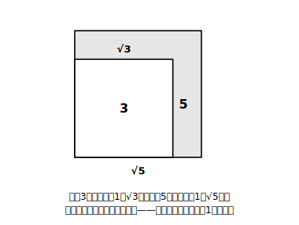

# L03 平方根の大小

## ねらい

- 正の数a, bについて、**a＜bならば√a＜√b** を数直線・面積の両面から納得し、使えるようになる。
- √の付いた数と整数（や小数）の大小を、**2乗して比べる**方法で判断できるようになる。

## 導入：√3と√5、どちらが大きい？

前回、√の付いた数を数直線に並べた。並べられるということは、**大小が決まる**ということだ。では√3と√5はどちらが大きいだろう。挟み撃ちで近似値を出してもいいが、実はもっと速い方法がある。今日はその「比べ方の型」を手に入れる。

## 主概念1：√の中身が大きいほど、√も大きい

正方形で考えるとはっきり見える。√3は「面積3の正方形の1辺」、√5は「面積5の正方形の1辺」だ（1辺x、面積aなら x²＝a、つまり x＝√a）。

面積の大きい正方形ほど、1辺は長い。つまり、

> **a, bが正の数のとき、a＜b ならば √a＜√b**

√の中身の大小が、そのまま√の大小になる。だから √3＜√5。中身を見るだけで勝負がつく。

逆向きも成り立つ（√a＜√b ならば a＜b）。2乗しても大小の順番は崩れない——**正の数どうしなら、2乗の世界とそのままの世界で、大小の順位は一致する**からだ。

## 主概念2：整数と√を比べる——「2乗の世界」に持ちこむ

では √7 と 3 では、どちらが大きい？ 片方にしか√が付いていないときは、**両方とも2乗して**、√のない世界で比べればいい。

- (√7)²＝7
- 3²＝9

7＜9 だから √7＜3。これだけだ。

負の数がまざるときは、2乗する前に符号で判断する。−√5 と 2 なら、負の数＜正の数 だから −√5＜2（2乗は不要）。−√5 と −√3 のように**負どうし**なら、数直線を思い出そう。√3＜√5 で、負の側では0から遠いほど小さいから、**−√5＜−√3**。絶対値の大きい方が小さい——中1の負の数の大小と同じ規則が、√にもそのまま通用する。

:::guide
**「2乗して比べる」が許されるのはなぜか——そして落とし穴**

2乗して比べてよい根拠は、主概念1の「正の数どうしなら2乗しても大小の順位が変わらない」にある。裏を返すと、**負の数がまざった瞬間、この技はそのままでは使えない**。たとえば −3 と 2 を2乗すると 9 と 4 で大小が逆転する。だから手順は「①まず符号を見る（正と負なら即決）②同符号なら2乗して比べる（負どうしは向きが逆になることに注意）」の順。①を飛ばして機械的に2乗するのがいちばん危ない。
:::

:::guide
**≦・≧と「以上・以下・未満」もここで再点検**

大小を扱うこの機会に、不等号の読みも確認しておこう。√a≦3 は「√aは3**以下**」（3ちょうども含む）、√a＜3 は「3**未満**」（3は含まない）。この区別は、練習4のような「√aが整数nになる場合を含むか」を数える問題で答えがずれる急所になる。境目の数を含むか含まないか、いつも一言つぶやいてから数えるとよい。
:::

## 練習

1. 次の各組の数の大小を、不等号を使って表そう。
   (1) √11, √13　(2) 4, √17　(3) 5, √24　(4) −√6, −√7
2. 次の数を小さい順に並べよう。 3, √8, −2, √10, 0
3. √aが 6＜√a＜7 を満たすとき、正の整数aの範囲を求めよう（a＝□から□まで）。
4. 4≦√a≦5 を満たす正の整数aは何個あるだろう。（≦だから、両端を含むかどうかに注意！）

:::stretch
**S1** 0.5 と √0.5 では、どちらが大きいだろう。2乗して確かめてみよう。「√を付けると小さくなる」と思いこんでいた人は、なぜ1より小さい数では様子が違うのか、面積のことば（面積0.25の正方形と面積0.5の正方形）で説明してみよう。
:::

:::zatsudan
「どちらが大きいか比べられる」って、当たり前のようで実はすごいことなんだ。√2＋1 みたいな見慣れない数が出てきても（この形はL08で登場する）、数直線のどこかに必ず1つ席がある——それがわかっているから、わたしたちは安心して√を「数」として扱える。新入りに席を用意してから技を教える。この章の順番は、そういう作りになっている！
:::

---

対応解答: answer_key_L01-04.md

<!-- gen_nav:nav:start（自動生成・手編集しない） -->

---

[← 前のレッスン](lesson_02.md)｜[単元の目次](README.md)｜[解答](answer_key_L01-04.md)｜[次のレッスン →](lesson_04.md)

<!-- gen_nav:nav:end -->
