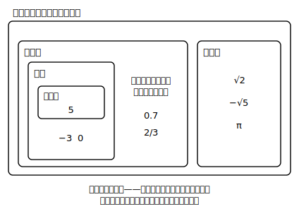

# L04 有理数と無理数——数の世界の第2幕

## ねらい

- **有理数**（分数で表せる数）と**無理数**（分数で表せない数）の定義を理解する。
- 小学校からの数の分類（自然数→整数→…）に有理数・無理数を加えた**全体地図**を自分でかけるようになる。

## 導入：新入りに「族の名前」を付ける

この章で、√2 や √5 という新しい数が仲間入りした。ところで、新入りが入ったら、もともといた数たちとの関係を整理したくなるのが数学だ。中1では、数の世界を「自然数→整数→（分数・小数を含む）数全体」と広げた。今日はその地図を、中3版に更新する。

## 主概念1：有理数——分数で表せる数

**整数mと0でない整数nを使って、分数 m/n の形で表せる数を有理数という。**

有理数の守備範囲は意外と広い。

- 整数: 5＝5/1、−3＝−3/1 → 有理数
- 小数: 0.7＝7/10、−1.25＝−5/4 → 有理数
- √の付いた数でも: √9＝3＝3/1 → 有理数（√が付いていても、中身が平方数なら整数に直せる）

0.333…のように**同じ並びがくり返される小数**（循環小数）も、実は分数（1/3）に直せるので有理数だ。

## 主概念2：無理数——分数では表せない数

一方、√2＝1.41421356… は、どこまで書いても終わらず、くり返しのパターンも現れない。そして√2は**分数では表すことができない**（L01で予告したとおり。理由づけは高校で学ぶ）。

**分数 m/n の形で表すことができない数を無理数という。**

√2、√5、−√3 などのほか、実はおなじみの**π**も無理数であることが**知られている**（その確かめ方は高校以降のお楽しみだ）。円周率3.14…を「π」という1文字で表したのは、分数でぴったり書く手がそもそもなかったから——L01の「πと√は同じ発想」には、こういう裏事情もあったのだ。

ここで地図を完成させよう。

- 数はまず**有理数**と**無理数**に分かれる。
- 有理数の中に**整数**があり、整数の中に**自然数**がある。
- 中1で覚えた分類語（自然数・素数・整数）に、中3で**有理数・無理数**が加わった。

:::guide
**「無理数」は「無理やりな数」ではない——名前の役割分担**

有理数・無理数という名前は、「比（分数）で表せる／表せない」という一点だけで数の世界を**もれなく・重なりなく**二分するラベルだ。判定のコツは順番にある。①まず整数・分数・有限小数なら即「有理数」。②√が付いていたら、中身が平方数（1, 4, 9, 16, …）かどうかを見る——平方数なら√が外れて有理数、外れなければ無理数と判断してよい（この章に出てくる範囲では）。「√が付いている＝無理数」と機械的に覚えると、√9 や √(4/25) でつまずく。**√は見た目、有理数かどうかは中身**で決まる。
:::

:::guide
**循環小数はなぜ分数に直せるのか（一歩だけ深く）**

0.333…＝1/3 は、1÷3を筆算すると同じ余りが出続けることから納得できる。逆に「くり返す小数は必ず分数に直せる」ことが**知られている**——たとえば x＝0.333… と置いて 10x−x＝3.333…−0.333…＝3、よって 9x＝3、x＝1/3 という計算で、その感触を掴もう（どんなくり返しでも通用することのきちんとした確かめは、先の学習に譲る）。つまり「小数がくり返す」ことと「分数で表せる」ことは、コインの裏表なのだ。√2の小数がくり返しのパターンを持たないのは、√2が分数で表せないことの「小数側から見た姿」だと言える。
:::

:::zatsudan
中1の4月、数直線が0の左側へすっと延びたときのことを覚えているかな？ 負の数という新入りにみんなが少しずつ慣れていった、あれが数の拡張の第1幕——そして今回の√が第2幕だ。おもしろいのは、どちらの幕でも「新しい数を認めたら、計算のルールがそのまま通用するように世界を設計し直す」ことをやっている点。次のL05からは、まさに√の計算ルール作りが始まるよ！
:::

## 練習

1. 次の数を、有理数と無理数に分けよう。
   √6, −4, 0.15, √16, π, −√10, 7/3, 0
2. 次の文が正しければ○、正しくなければ×を付けて理由を一言そえよう。
   (1) 整数はすべて有理数である。
   (2) √の付いた数はすべて無理数である。
   (3) 無理数は数直線上に置くことができない。
3. 「面積が7cm²の正方形の1辺の長さ」は有理数だろうか、無理数だろうか。√を使って表してから判断しよう。
4. 中1で学んだ分類語「自然数」「整数」と、今日の「有理数」「無理数」を全部使って、次の数をいちばん狭い分類まで言い当てよう。
   (1) 8　(2) −5　(3) 0.6　(4) √11

:::stretch
**S1** 「無理数＋有理数」は必ず無理数になる（例: √2＋1。この形はL08で「一つの数」として再登場する）。もし √2＋1 が有理数（分数で表せる数）だったとしたら、√2＝(√2＋1)−1 も分数で表せてしまう——この説明のどこが「√2は無理数」という事実と衝突するか、自分の言葉で言ってみよう。「もし〜だったら、おかしなことが起こる」という説明の型は、中2の図形で使った「反例」や、高校で学ぶ「背理法」につながっている。調べるなら「背理法 とは 中学生」。
:::

---

対応解答: answer_key_L01-04.md

<!-- gen_nav:nav:start（自動生成・手編集しない） -->

---

[← 前のレッスン](lesson_03.md)｜[単元の目次](README.md)｜[解答](answer_key_L01-04.md)｜[次のレッスン →](lesson_05.md)

<!-- gen_nav:nav:end -->
