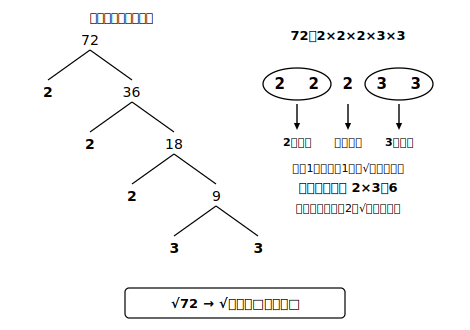

# L06 √の中を簡単にする——a√bの形

## ねらい

- 素因数分解を使って、√の中から**2乗の部分を外へ出す**変形（√50＝5√2 型）ができるようになる。
- 逆に、外の数を中へ入れる変形（3√2＝√18 型）もできるようになる。
- **変形した数の「大きさ」まで言う**——a√bの形と数直線・挟み込みを往復する習慣を付ける。

## 導入：√50を、もっと見通しよく

√50 という数を考える。50＝2×5² だから、L05の公式を逆向きに使うと、

√50＝√(25×2)＝√25×√2＝5×√2＝5√2

√50 と 5√2 は**同じ数の2通りの書き方**だ。では、どちらが「よい」書き方だろう？ 今日はこの変形の技術と、変形することの意味の両方を手に入れる。

## 主概念1：2乗の部分を外へ出す——素因数分解の再登場

√の中の数を素因数分解して、**2乗（ペア）になっている素因数を見つけたら、√の外へ出せる**。

√72 でやってみよう。72＝2³×3²＝(2²×3²)×2＝(2×3)²×2 だから、

√72＝√(6²×2)＝√(6²)×√2＝6√2

手順はいつも同じ3段だ。

1. √の中を**素因数分解**する（中1の道具がここで再登場！ L01の準備運動4はこの伏線だった）。
2. **同じ素因数のペア**を探す。ペア1組につき、その素因数を1つ√の外へ出せる。
3. ペアにならず残った素因数だけを√の中に残す。

逆向きの変形も同じ理屈でできる。外の数は2乗して中へ入る:

3√2＝√(3²)×√2＝√(9×2)＝√18

:::guide
**なぜ「中を小さく」するのか——見た目の問題ではない**

√50 より 5√2 が好まれるのには実利がある。①**大きさが見積もりやすい**（√2≒1.41さえ覚えていれば 5√2≒7.05 と暗算できる。√50 のままでは挟み撃ちからやり直しだ）。②**同じ√かどうかが見抜ける**（√50 と √2 は一見無関係だが、5√2 と √2 なら「同じ√2の仲間」と一目でわかる——この点は次のL08の加法・減法で決定的に効く）。つまりこの変形は、身だしなみではなく**次の計算への段取り**なのだ。
:::

## 主概念2：変形したら、大きさまで言う

ここで、この章の背骨になる習慣をひとつ約束したい。

> **a√bの形に変形したら、「それはおよそいくつか」「どの整数とどの整数の間か」まで言って1セット。**

たとえば √45＝3√5。ここで終わらせない。√5 は 2＜√5＜3（2²＝4＜5＜9＝3²）だから、3√5 はその3倍で **6＜3√5＜9**。もう少し細かく √5≒2.24 を使えば 3√5≒6.72。「√45 は7弱の数だ」——ここまで言えて、√45 と友達になれたと言える。

変形の技術（3√5 と書ける）と、大きさの感覚（7弱だとわかる）は、**別の能力**だ。技術だけが先に走ると、「3√5 と正しく書けるのに、それが6より大きいかと聞かれると手が止まる」ということが起こる。この章では毎回、両方セットで確かめていく。

:::zatsudan
√2≒1.414の近似値、実は一度覚えるとかなり便利。5√2なら約7.07と、√50の大きさが暗算で出せてしまう。A判の用紙——コピー用紙のあのサイズにも、実は√2がひそんでいる（くわしくはL09のお楽しみ）。身の回りの紙の中に、今日変形した数たちが隠れていると思うと、ちょっと見る目が変わらない？
:::

:::guide
**「これ以上簡単にならない」の判定——完了チェック**

変形の答案でよくある迷いは「どこまでやれば終わりか」だ。完了の条件は、**√の中に2乗の因数（ペアの素因数）が残っていないこと**。たとえば √48＝2√12 で止めると、12＝2²×3 の中にまだペアが残っている（正しくは 4√3 まで）。検算を兼ねた確認手順は、①中の数を素因数分解し直してペアがないことを見る ②外の数を2乗して中へ戻し、元の数になるか確かめる（4√3→√48 ✓）の2つ。①が完了チェック、②が正しさチェックだ。
:::

## 練習

1. 次を a√b の形（√の中をできるだけ小さく）に変形しよう。
   (1) √20　(2) √27　(3) √98　(4) √108
2. 次を √a の形に変形しよう。
   (1) 2√6　(2) 5√3
3. √80 を a√b の形に変形し、さらに「どの整数とどの整数の間の数か」を答えよう（√5 の挟み込みから考える）。
4. 次の変形について考えよう。
   √32＝2√8
   この等式は、値として正しいだろうか——2乗（または外の数を中に戻す）で確かめよう。また、「√の中をできるだけ小さく」する変形としては完了しているだろうか。完了した形（√の中が最も小さい整数になる形）まで整理しよう。
5. √2≒1.414 として、√200 の近似値を求めよう（電卓なしで）。

:::stretch
**S1** √(2²×3²) は 2×3＝6 だが、√(2²＋3²)＝√13 は 2＋3＝5 にならない（13≠25）。「√はかけ算のペアは外に出せるのに、たし算はなぜ出せないのか」。(√a×√b)²＝ab の確かめ（L05）をまねて、(√a＋√b)² を展開するとどうなるか、前章の乗法公式で計算してみよう。——この観察は、次のL08の中心テーマの予告編になっている。
:::

---

対応解答: answer_key_L05-08.md

<!-- gen_nav:nav:start（自動生成・手編集しない） -->

---

[← 前のレッスン](lesson_05.md)｜[単元の目次](README.md)｜[解答](answer_key_L05-08.md)｜[次のレッスン →](lesson_07.md)

<!-- gen_nav:nav:end -->
