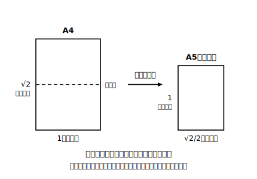

# L09 A判の紙にひそむ√2

## ねらい

- A判の紙（コピー用紙など）の2辺の比が **1:√2** であることを、紙を折る実験と√の計算の両方から確かめる。
- 「半分にしても同じ形」という性質が、√2という無理数**でなければ実現できない**ことを説明できるようになる。

## 導入：コピー用紙の「あの形」は、誰が決めた？

A4のコピー用紙を1枚、手もとに用意してほしい（なければA判・B判どの紙でもよい。図を見ながら読み進めることもできる）。この長方形、正方形でもなければ、極端な細長でもない、あの絶妙な形。実は、この形は適当に決まったのではない。**「半分に切っても、まったく同じ形になる」** という、ただ1つの条件から数学的に決まっている。そして、その条件を満たす鍵こそが——この章の主役、√2 だ。

## 活動：折って確かめる

A4の紙を、長い方の辺が半分になるように折ってみよう（短い辺どうしを合わせる折り方だ）。折ってできた半分の長方形（＝A5の大きさ）を、元のA4と見比べる。

半分の長方形は、元の長方形を90度回して縮めた、**そっくり同じ形**に見えるはずだ。向きは変わるが、縦横の比率が保たれている。だからA4を半分にするとA5、A5を半分にするとA6……と、同じ形の家族がどこまでも続く。

見た目の「そっくり」を、数学の言葉で確かめよう。

## 説明：なぜ比は1:√2でなければならないのか

短い辺を1、長い辺をxとする（x＞1）。「半分に折っても同じ形」を式にする。

- 元の紙: 短辺1、長辺x → 縦横の比は **1:x**
- 半分の紙: 短辺x/2、長辺1 → 縦横の比は **x/2:1**

同じ形ということは比が等しいということだから、1:x＝x/2:1。比例式の性質（内項の積＝外項の積）から、

x×(x/2)＝1×1　つまり　x²＝2

x²＝2 を満たす正の数——それは **x＝√2**、まさにL01で出会った「あの数」だ。つまり、

> **「半分にしても同じ形」を実現する長方形は、2辺の比が1:√2のものしかない。**

もし比が整数や簡単な分数（たとえば1:1.5）だったら、半分にするたびに形が崩れていく。**無理数√2だからこそ、この性質が成り立つ**。√2は教科書の中だけの数ではなく、毎日手にする紙の形を決めている現役の設計値なのだ。

実測でも確かめられる。手もとの紙の短辺を定規で測り、その値に √2≒1.414 をかけてみよう。計算結果が、実際に測った長辺の値とほぼ一致するはずだ（1.414 の2乗検算: 1.414²＝1.999396≒2）。理屈で出した比が、目の前の紙で本当に成り立っている——この瞬間が、活用の醍醐味だ。

:::guide
**「比で示す」と「実測で示す」の役割分担**

この課題では2種類の確かめをした。①比例式から x²＝2 を導く**理屈の確かめ**と、②手元の紙の短い辺を測って×1.414し、長い辺の実測値とほぼ一致することを見る**実測の確かめ**。①は「なぜ√2でなければならないか」に答え、②は「本当にそうなっているか」に答える。どちらか片方では説明として弱い——理屈だけでは現実との接点がなく、実測だけでは「たまたま」の可能性が残る。両輪で示して初めて胸を張れる。この構えは、後の三平方の定理の検証や、高校以降の「モデルと実測」の関係にそのまま続いていく。
:::

:::guide
**比例式を立てるときの向きの事故**

「半分の紙の比」を x/2:1 でなく 1:x/2 と置いてしまうと、式が x²＝4 になって x＝2 が出てくる（明らかに紙の形と合わない）。事故の原因は、**「短辺:長辺」の順序を元の紙と半分の紙でそろえていない**こと。比を等しいと置くときは、両方の比を「短い方:長い方」の同じ順序で書く——この一点だけ守れば安全だ。出てきた答えが現実（紙の見た目）と合うかを最後に見る習慣も、事故の検出器として働く。
:::

:::zatsudan
A4を半分にたたむとA5、そのまた半分がA6——逆にA4を2枚並べるとA3になる。コピー用紙のA判は、この「たたんでも広げても同じ形」がそろうように作られた家族なんだ。もし比が1:√2じゃなかったら、半分にするたびに縦長になったり横長になったり……サイズの家族はそろわなかったはず。√2は、コピー用紙の「そろっている感じ」を静かに支えている縁の下の力持ちなんだ！
:::

## 練習

1. 本文の比例式 1:x＝x/2:1 から x²＝2 を導く計算を、自分の手で再現しよう。
2. 短辺が20cmのA判型（2辺の比1:√2）の長方形がある。√2≒1.414として、長辺の長さを求めよう。また、この紙を半分に折ってできる長方形の短辺と長辺も求めよう（小数第1位まで）。
3. 「2辺の比が1:2の長方形」を半分に折る（長辺を半分にする）と、どんな比の長方形になるだろう。「半分にしても同じ形」が成り立たないことを確かめよう。
4. 短辺が√2cmのA判型（2辺の比1:√2）の長方形がある。長辺の長さと面積を、√を使って（または整数で）表そう。答えが「√が消えてふつうの数になる」ところに注目！

:::stretch
**S1** 短辺1・長辺√2のA判型の紙を、半分ではなく**長辺方向に3等分**したら、できる細長い紙の比はどうなるか計算してみよう。「同じ形」は保たれるだろうか。「半分」という操作と1:√2の組がいかに特別かを、比の計算で味わう問題だ。

（発展: 「もし『3等分しても同じ形』の紙を作りたければ、比はどうなるべきか」も考えられる。x²＝3 を満たす数——そう、1:√3の紙だ。実際の紙の規格がなぜ1:√2に決められているのかを調べるフレーズ例:「コピー用紙 サイズ 比 ルート2」）
:::

---

対応解答: answer_key_L09-11.md

<!-- gen_nav:nav:start（自動生成・手編集しない） -->

---

[← 前のレッスン](lesson_08.md)｜[単元の目次](README.md)｜[解答](answer_key_L09-11.md)｜[次のレッスン →](lesson_10.md)

<!-- gen_nav:nav:end -->
