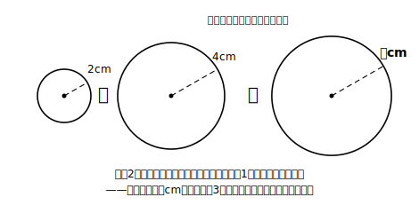

# L10 面積から長さへもどる——円の面積の和

## ねらい

- 「面積が与えられて、長さを逆算する」場面で√を使いこなす（x²＝a → x＝√a、xは正）。
- 答えをa√bの形で正確に表し、必要に応じて近似値に直して現実の量として解釈する——この章の総合演習。

## 導入：2つの円を、1つの円にまとめたい

半径2cmの円と、半径4cmの円がある。この2つの円の面積を**合わせた面積**をもつ、1つの大きな円を作りたい。その円の半径は何cmにすればよいだろう？

「半径2＋4＝6cmでいいのでは？」と思った人は、ぜひこの直感のまま読み進めてほしい。この予想が正しいかどうかも、今日きちんと決着をつける。

## 解決：面積の世界で足して、長さの世界へ√でもどる

**手順1: それぞれの面積を求める。** 半径rの円の面積は πr² だった。

- 半径2cmの円: π×2²＝4π (cm²)
- 半径4cmの円: π×4²＝16π (cm²)
- 面積の和: 4π＋16π＝20π (cm²)

**手順2: 求める円の半径をx cmとして、式を立てる。**

πx²＝20π　両辺をπで割って　**x²＝20**

**手順3: √で長さへもどる。** xは半径（正の数）だから、

x＝√20＝√(4×5)＝**2√5 (cm)**

これが正確な答え。近似値でつかむと √5≒2.236 だから x≒4.47cm。

さて、導入の予想「半径6cm」はどうだったか。2√5≒4.47 だから、**6cmでは大きすぎる**。半径を6cmにすると面積は36πとなり、20πを大きく超えてしまう。**面積は半径の2乗で効く**ので、長さの世界の足し算（2＋4）をそのまま持ちこむと失敗する。√の言葉で書くと、正しい半径は √(2²＋4²)＝√20 であって、√(2²)＋√(4²)＝2＋4＝6 ではない——L08で確かめた「√の中身は足せない」と同じ地形が、円の姿で現れたのだ。

:::guide
**「2乗の世界」と「長さの世界」の往復地図**

この章の総まとめとして、往復の地図を言葉にしておこう。長さ→面積は「2乗する」（行き）、面積→長さは「√を取る」（帰り）。行きは中1までで自由にできていた。この章で手に入れたのは**帰り道**だ。そして帰り道には注意書きがある——①帰り先は正の値を選ぶ（長さだから）②足し算は2乗の世界で済ませてから帰る（半径どうしを足してはいけない）③帰ってきた値はa√bに整えて、近似値で大きさも言う（L06の約束）。二次方程式の章では、この帰り道が「x²＝b型の方程式を解く」という形でそのまま主役になる。
:::

:::guide
**近似値で答えるときの心得（付帯の話題として軽く）**

x＝2√5 が正確な値、x≒4.47cm は近似値——この区別はL02で学んだとおりだ。現実にコンパスで円をかくなら、定規の目盛りの限界があるから近似値で十分。ただし「どこまで細かく言うか」は場面が決める。設計図なら細かく、目分量の工作なら4.5cmで足りる。**誤差**とは、測定などで得た値と真の値とのずれのこと。**測定には必ず誤差が伴う**ので、「正確な値は√で持っておき、使う瞬間に必要な精度の近似値へ直す」が√時代の賢い運用だ。誤差や有効数字の話は、教科書ではこの章の周辺で軽く触れられる話題なので、深入りはここまでにしておく。
:::

:::zatsudan
「面積を2倍にしたければ、半径は√2倍」——今日の計算から出てくるこの事実、L09のA判の紙とそっくりの構造をしている。紙も円も、**長さが√2倍になると面積が2倍**——図形が違っても、2乗と√の関係は同じ顔で現れる。次の三平方の定理の章では、この「面積から長さへもどる」技がいよいよ主戦場に立つ。√はそこで、対角線や斜辺の長さを言い表す公用語になるよ！
:::

## 練習

1. 半径3cmの円と半径6cmの円の面積の和と等しい面積をもつ円の半径を、√を使って表そう。さらに√5≒2.236を使って近似値（小数第1位まで）も求めよう。
2. 面積が18πcm²の円の半径を求めよう（a√bの形まで整理すること）。
3. 面積が12cm²の正方形の1辺の長さを、a√bの形で表そう。また、この正方形の1辺は、面積3cm²の正方形の1辺の何倍だろう。
4. 「半径5cmの円と半径5cmの円の面積の和と等しい円の半径は10cmである」——この主張のまちがいを説明し、正しい半径を求めよう。

:::stretch
**S1** 面積の和ではなく**差**でも同じ技が使える。半径6cmの円から半径4cmの円をくりぬいたドーナツ形と同じ面積をもつ「1つの円」の半径を求めてみよう。

**S2** 正方形でも試そう。面積5cm²の正方形と面積20cm²の正方形の1辺は、それぞれ√5cm、2√5cm——ちょうど2倍の関係だ。面積が4倍になると1辺が2倍になる理由を、√の性質（√(4a)＝2√a）で説明してみよう。
:::

---

対応解答: answer_key_L09-11.md

<!-- gen_nav:nav:start（自動生成・手編集しない） -->

---

[← 前のレッスン](lesson_09.md)｜[単元の目次](README.md)｜[解答](answer_key_L09-11.md)｜[次のレッスン →](lesson_11.md)

<!-- gen_nav:nav:end -->
