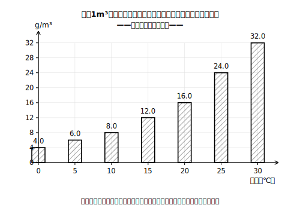
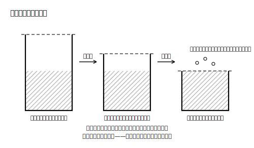

# レッスン1 空気が水蒸気を含める「上限」は温度で決まる

## ここで学ぶこと

空気は水蒸気を含んでいますが、いくらでも含めるわけではありません。**上限**があります。この上限のことを**飽和水蒸気量**といい、「空気1m³あたりに含むことのできる水蒸気の最大の質量」を、1m³あたりのグラム数［g/m³］で表します。今日いちばん大事なのはこれです——**上限の大きさは、気温によって変わる**。気温が高い空気ほど上限は大きく、気温が低い空気ほど上限は小さいのです。つまり同じ量の水蒸気を含んでいても、気温がちがえば「余裕」がちがいます。この「温度で変わる上限」が、次のレッスンで学ぶ湿度の**分母**になります。

## 小学校とのつながり

小5で「百分率」を学びましたね？ 「くらべられる量÷もとにする量×100」です。あのとき「もとにする量」は、多くの場合そのまま問題文に書いてありました。湿度では、**もとにする量（分母）＝飽和水蒸気量が気温によって決まる**ので、まず「いまの気温では上限はいくつか」を表で調べる一手間が入ります。参照する量が気温しだいで変わる——ここが中2の新しさです！ まずこのレッスンで「分母になる量＝飽和水蒸気量」の感覚をつくりましょう。

## 数表の読み方

> **注意**：下の数表は、この教材の練習用に作った**架空の数表**です。実際の飽和水蒸気量の値は教科書で確認してください。

| 気温［℃］ | 0 | 5 | 10 | 15 | 20 | 25 | 30 |
|---|---|---|---|---|---|---|---|
| 飽和水蒸気量［g/m³］（架空値） | 4.0 | 6.0 | 8.0 | 12.0 | 16.0 | 24.0 | 32.0 |

読み方は2ステップです。①上の行で気温を探す → ②その真下の値を読む。たとえば気温20℃の空気1m³が含むことのできる水蒸気の上限は、この架空数表では16.0gです。表を右へ進む（気温が上がる）ほど値が大きくなっていることも確かめてください。

## 例題

**例題1**　この架空数表で、気温10℃の空気1m³が含むことのできる水蒸気の上限は何gか。小数第1位まで答えること。

**考え方**　表の「10」の真下を読む。→ **8.0g**

**例題2**　この架空数表で、気温25℃の空気と気温5℃の空気では、1m³が含むことのできる水蒸気の上限は何gちがうか。小数第1位まで答えること。

**考え方**　25℃の上限24.0g、5℃の上限6.0g。差は 24.0−6.0＝**18.0g**。同じ1m³でも、気温がちがうと上限はこんなにちがうのです！

## 練習問題

以下すべて、上の**架空の練習用数表**を使うこと。

1. 気温15℃の空気1m³が含むことのできる水蒸気の上限は何gか。小数第1位まで答えること。
2. 気温30℃の空気1m³の上限は、気温0℃の空気1m³の上限の何倍か（整数で答えること）。
3. ある部屋の空気1m³に水蒸気が10.0g含まれている。この空気の気温が15℃のとき、上限まであと何g余裕があるか。小数第1位まで答えること。
4. 問3と同じ空気（水蒸気10.0g/m³）で、気温が25℃だったら、余裕は何gか（小数第1位まで答えること）。問3と比べてどちらが「余裕あり」か。

## stretch（発展）

**S1**　この架空数表で、気温が5℃から10℃に上がるときの上限の増え方（＋2.0g）と、25℃から30℃に上がるときの増え方を比べなさい。同じ「5℃上がる」でも増え方は同じか？　気づいたことを一文で書きなさい。

## ☕ 雑談枠：霧の朝のからくり

夜から朝にかけて気温が下がると、空気の「上限」も小さくなります。水蒸気の量が変わらないとしたモデルで考えると、器のほうが縮んでいく、とイメージするとよいでしょう（実際の空気が物理的な器を持っているわけではありません）。上限が実際の水蒸気量まで縮むと、含みきれなくなった水蒸気が細かい水滴になって現れる——これが霧の正体の考え方です。「気温が下がると湿度が上がる」という規則性、次のレッスンで計算として確かめられますよ！

<!-- gen_nav:nav:start（自動生成・手編集しない） -->

---

[単元の目次](README.md)｜[解答](answer_key_supplement.md)｜[次のレッスン →](lesson_02.md)

<!-- gen_nav:nav:end -->
