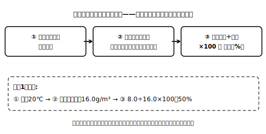

# レッスン2 湿度の定義と求め方（順算）

## ここで学ぶこと

**湿度**とは、空気に水蒸気が含まれている度合いを表す量です。定義はこうです。

> **湿度［%］＝ 空気1m³中の水蒸気量［g/m³］ ÷ その気温での飽和水蒸気量［g/m³］ × 100**

小5の百分率とまったく同じ形——「くらべられる量÷もとにする量×100」——ですが、ひとつだけ大ちがいの点があります。**もとにする量（分母）＝飽和水蒸気量が、気温によって変わる**のです。だから湿度を求めるときは、必ず「①いまの気温を確かめる → ②表でその気温の飽和水蒸気量（分母）を引く → ③割って100倍」の順で進めます。分母を表から引く一手間が入るのが、中2の湿度計算です！

> **注意**：このレッスンの数表は、この教材の練習用に作った**架空の数表**です。実際の値は教科書で確認してください。

| 気温［℃］ | 0 | 5 | 10 | 15 | 20 | 25 | 30 |
|---|---|---|---|---|---|---|---|
| 飽和水蒸気量［g/m³］（架空値） | 4.0 | 6.0 | 8.0 | 12.0 | 16.0 | 24.0 | 32.0 |

## 例題

**例題1**　ある部屋の空気は気温20℃で、1m³あたり8.0gの水蒸気を含んでいる。この空気の湿度は何%か。整数で答えること。

**考え方**
①気温は20℃。
②架空数表より、20℃の飽和水蒸気量（分母）は16.0g/m³。
③湿度＝8.0÷16.0×100＝**50%**

**例題2**　別の部屋の空気は気温10℃で、1m³あたり6.0gの水蒸気を含んでいる。湿度は何%か。整数で答えること。

**考え方**　分母は10℃の8.0g/m³。6.0÷8.0×100＝**75%**。
例題1の部屋（8.0g）より水蒸気の**量**は少ないのに、湿度は高い！　分母が小さいからですね。「水蒸気が多い＝湿度が高い」とは限らないのです。

## 検算のコツ

中学理科の標準的な表問題では、湿度は**通常0〜100%** の範囲に収まります。もし計算結果が200%のような値になったら、分子（実際の水蒸気量）と分母（飽和水蒸気量）を取りちがえていないか疑ってみましょう。「小さいほう÷大きいほう」になっているかの見直しが、いちばん早い検算です。

## 練習問題

以下すべて架空の練習用数表を使うこと。答えは指示どおりに丸めること。

1. 気温25℃の教室の空気が、1m³あたり12.0gの水蒸気を含んでいる。湿度は何%か。整数で答えること。
2. 気温15℃の部屋の空気が、1m³あたり9.0gの水蒸気を含んでいる。湿度は何%か。整数で答えること。
3. 気温30℃の体育館の空気が、1m³あたり12.0gの水蒸気を含んでいる。湿度は何%か。小数第1位まで答えること。
4. 問1と問3の空気は、含んでいる水蒸気量が同じ12.0g/m³である。湿度が高いのはどちらか。理由を「分母」という言葉を使って一文で書きなさい。
5. ある生徒が、気温20℃・水蒸気量8.0g/m³の空気の湿度を「16.0÷8.0×100＝200%」と計算した。どこをまちがえたか、一文で指摘しなさい。

## stretch（発展）

**S1**　気温20℃・湿度50%の部屋Aと、気温10℃・湿度75%の部屋Bでは、1m³中の水蒸気の**量**はどちらが多いか。架空数表を使って計算で示しなさい（量の計算のやり方は次のレッスンで詳しく学びますが、定義の式から考えてみよう）。

## ☕ 雑談枠：「湿度が下がった」のに水蒸気は増えていない？

朝より昼のほうが湿度の数値が低くなることがあります。水蒸気が逃げたのでしょうか？　そうとは限りません。気温が上がると分母（飽和水蒸気量）が大きくなるので、水蒸気の量が同じでも割合＝湿度は下がるのです。分数で分母だけが大きくなる、あの感覚ですね。湿度は「量」ではなく「割合」——これがこの単元の合言葉です！

<!-- gen_nav:nav:start（自動生成・手編集しない） -->

---

[← 前のレッスン](lesson_01.md)｜[単元の目次](README.md)｜[解答](answer_key_supplement.md)｜[次のレッスン →](lesson_03.md)

<!-- gen_nav:nav:end -->
