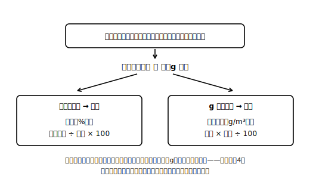

# レッスン3 逆算する——水蒸気量を求める

## ここで学ぶこと

前のレッスンでは「水蒸気量→湿度」の順算をやりました。今回はその**逆**、「湿度→水蒸気量」です。定義の式を変形すると、

> **空気1m³中の水蒸気量［g/m³］＝ その気温での飽和水蒸気量［g/m³］ × 湿度［%］ ÷ 100**

小5の割合でいえば「もとにする量×割合＝くらべられる量」、三用法の使い分けと同じです。湿度の問題ではここでも、**もとにする量（分母だった飽和水蒸気量）を表から引いてくる**手順が最初に入ります。順算か逆算か迷ったら、「求めたいのは％か、gか？」を先に確認しましょう。**湿度の式から**水蒸気量（g）を求めるときは掛け算の出番です！（この合言葉は湿度の式を使う場面に限ったもの。あとのレッスンで学ぶ凝結量のgは、引き算で求めます。）

> **注意**：このレッスンの数表は、この教材の練習用に作った**架空の数表**です。実際の値は教科書で確認してください。

| 気温［℃］ | 0 | 5 | 10 | 15 | 20 | 25 | 30 |
|---|---|---|---|---|---|---|---|
| 飽和水蒸気量［g/m³］（架空値） | 4.0 | 6.0 | 8.0 | 12.0 | 16.0 | 24.0 | 32.0 |

## 例題

**例題1**　気温25℃の部屋の空気の湿度が50%である。この空気1m³に含まれている水蒸気は何gか。小数第1位まで答えること。

**考え方**
①気温25℃の飽和水蒸気量は、架空数表より24.0g/m³。
②水蒸気量＝24.0×50÷100＝**12.0g**

**例題2**　気温20℃の理科室の空気の湿度が75%である。空気1m³中の水蒸気量は何gか。小数第1位まで答えること。

**考え方**　16.0×75÷100＝**12.0g**。
例題1と同じ12.0gなのに、気温がちがうので湿度はちがう——順算・逆算のどちらから見ても、「湿度は量ではなく割合」が確かめられますね。

## 検算のコツ

逆算の答え（水蒸気量）は、**その気温の飽和水蒸気量より大きくならないはず**です（湿度が通常0〜100%の範囲の問題なら）。もし答えが分母より大きくなったら、割合を掛けるところで割り算・掛け算を取りちがえていないか見直しましょう。

## 練習問題

以下すべて架空の練習用数表を使うこと。答えは指示どおりに丸めること。

1. 気温30℃の空気の湿度が25%である。空気1m³中の水蒸気量は何gか。小数第1位まで答えること。
2. 気温15℃の空気の湿度が50%である。空気1m³中の水蒸気量は何gか。小数第1位まで答えること。
3. 気温20℃・湿度25%の空気Aと、気温5℃・湿度100%の空気Bでは、1m³中の水蒸気量はどちらが多いか。計算で比べなさい（どちらも小数第1位まで）。
4. ある生徒が、気温25℃・湿度50%の空気の水蒸気量を「50÷24.0×100≒208g」と計算した。式のどこがおかしいか、一文で指摘しなさい（ヒント：単位と、飽和水蒸気量の役割）。

## stretch（発展）

**S1**　気温25℃の空気1m³に含まれる水蒸気量が15.0gのとき、湿度は何%か。小数第1位まで答えること（順算に戻る問題。逆算とセットで行き来できるか確認！）。

**S2**　この架空数表で、水蒸気量12.0g/m³の空気の湿度がちょうど100%になる気温は何℃か。表から探しなさい。——この「ちょうど100%になる気温」には名前がついています。次のレッスンで学びます！

## ☕ 雑談枠：湿度100%でも雨とは限らない？

湿度100%と聞くと「土砂降り」を想像するかもしれませんが、湿度100%は「その気温の空気が水蒸気を上限いっぱいまで含んでいる」という割合の話で、雨が降っていることを直接意味しません。逆に、雨の最中でも、地上で測った湿度が100%に届いていないことがあると言われます（どの高さ・どの場所の空気の値かによって、湿度の値は変わります）。数値の定義に戻って考えると、天気のニュースの見え方が少し変わりますね！

<!-- gen_nav:nav:start（自動生成・手編集しない） -->

---

[← 前のレッスン](lesson_02.md)｜[単元の目次](README.md)｜[解答](answer_key_supplement.md)｜[次のレッスン →](lesson_04.md)

<!-- gen_nav:nav:end -->
