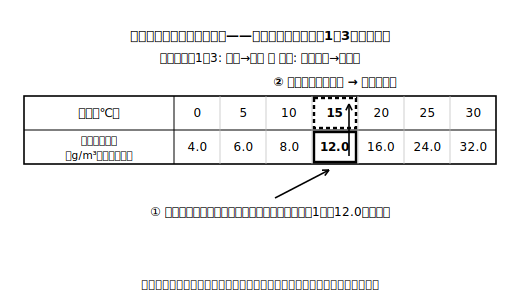
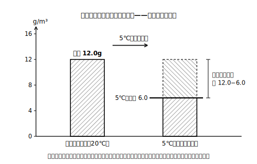

# レッスン4 露点を紙の上で判定する・凝結量は「差」で求める

## ここで学ぶこと

空気を冷やしていくと、上限（飽和水蒸気量）がだんだん小さくなっていきます。上限が、その空気が実際に含んでいる水蒸気量とちょうど等しくなったとき——つまり湿度がちょうど100%になったとき——の気温を**露点**といいます。露点は、数表を**逆引き**すれば紙の上で判定できます。「実際の水蒸気量の値を、表の下の行から探し、真上の気温を読む」だけです。さらに露点より下まで冷やすと、含みきれない分の水蒸気が水滴になります。この量（**凝結量**）は割合ではなく、**引き算（差）** で求めるのがポイントです。なおこの計算は、同じ1m³の空気で、水蒸気が外から出入りしないと考えたモデルによるものです。

> **注意**：このレッスンの数表は、この教材の練習用に作った**架空の数表**です。実際の値は教科書で確認してください。

| 気温［℃］ | 0 | 5 | 10 | 15 | 20 | 25 | 30 |
|---|---|---|---|---|---|---|---|
| 飽和水蒸気量［g/m³］（架空値） | 4.0 | 6.0 | 8.0 | 12.0 | 16.0 | 24.0 | 32.0 |

## 露点の判定手順（紙上）

①その空気が実際に含んでいる水蒸気量［g/m³］を確かめる → ②数表の**下の行**からその値を探す → ③真上の気温を読む。それが露点です。レッスン1〜3の「気温→上限」と読む向きが**逆**になることに注意！

## 例題

**例題1**　気温25℃の部屋の空気が、1m³あたり12.0gの水蒸気を含んでいる。この空気の露点は何℃か。整数で答えること（この架空数表にある気温から選ぶこと）。

**考え方**
①実際の水蒸気量は12.0g/m³。
②架空数表の下の行から12.0を探すと、真上は15℃。
③冷やしていって15℃になったとき、上限12.0g＝実量12.0gで湿度ちょうど100%。→ 露点は**15℃**

**例題2**　気温20℃の空気が、1m³あたり12.0gの水蒸気を含んでいる。この空気を5℃まで冷やすと、1m³あたり何gの水蒸気が水滴になるか。小数第1位まで答えること。

**考え方**
①5℃の上限は、架空数表より6.0g/m³。
②含んでいた12.0gのうち、6.0gまでしか含めなくなる。
③凝結量＝12.0−6.0＝**6.0g**。割り算は使いません。**引き算**です！

## 検算のコツ

- 標準的な問題で扱う範囲では、露点は**いまの気温より高くなることはありません**（冷やしていって到達する温度だからです）。答えがいまの気温より高くなったら、表の読む向きをまちがえていないか見直しましょう。
- 凝結量の答えは、**もとの水蒸気量より大きくなることはありません**。引き算の向き（大−小）も確かめましょう。

## 練習問題

以下すべて架空の練習用数表を使うこと。答えは指示どおりに丸めること。

1. 気温30℃の教室の空気が、1m³あたり8.0gの水蒸気を含んでいる。この空気の露点は何℃か。整数で答えること（この架空数表にある気温から選ぶこと）。
2. 気温25℃の廊下の空気が、1m³あたり6.0gの水蒸気を含んでいる。この空気の露点は何℃か。整数で答えること（この架空数表にある気温から選ぶこと）。
3. 気温15℃の部屋の空気が、1m³あたり12.0gの水蒸気を含んでいる。この空気を0℃まで冷やすと、1m³あたり何gの水蒸気が水滴になるか。小数第1位まで答えること。
4. 気温30℃の体育館の空気が、1m³あたり16.0gの水蒸気を含んでいる。
   (a) この空気の露点は何℃か。整数で答えること（この架空数表にある気温から選ぶこと）。
   (b) この空気を10℃まで冷やすと、1m³あたり何gの水蒸気が水滴になるか。小数第1位まで答えること。
5. ある生徒が、気温20℃・水蒸気量12.0g/m³の空気を5℃まで冷やしたときの凝結量を「12.0÷6.0×100＝200」と計算した。求め方のどこがまちがっているかを一文で指摘し、正しい凝結量を小数第1位まで答えること。

## stretch（発展）

**S1**　どちらも気温25℃の空気Aと空気Bがある。Aは水蒸気を1m³あたり12.0g、Bは8.0g含んでいる。それぞれの露点を整数で答え（この架空数表にある気温から選ぶこと）、露点が高いのはどちらか、「水蒸気量」という言葉を使って理由を一文で書きなさい。

## ☕ 雑談枠：小4理科の一文が、温度つきでパワーアップ

小4の理科で「空気が冷やされると、水蒸気は水になって現れる」と学びました。中2の露点は、この一文に**温度の目盛り**をつけたものです。「冷やされると水になる——では**何℃で**？」に、数表の逆引きひとつで答えられるようになった。同じ現象でも、数値で語れるようになるのが学年が上がるということですね！

<!-- gen_nav:nav:start（自動生成・手編集しない） -->

---

[← 前のレッスン](lesson_03.md)｜[単元の目次](README.md)｜[解答](answer_key_L04-05.md)｜[次のレッスン →](lesson_05.md)

<!-- gen_nav:nav:end -->
