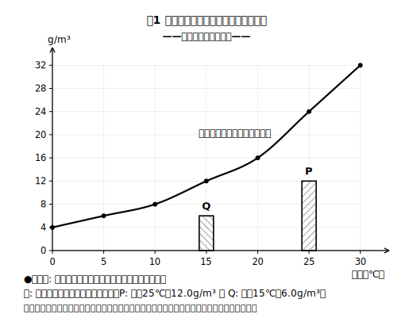
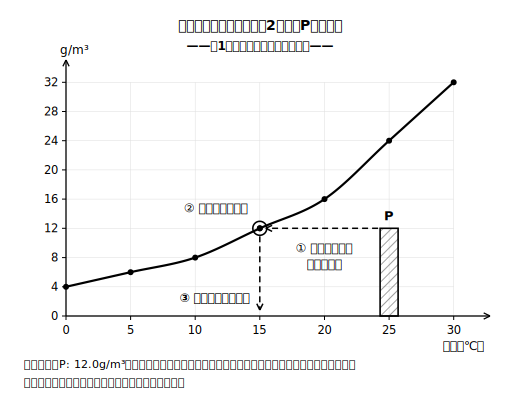

# レッスン5 複合グラフを読む——曲線は「上限」、棒は「いまの量」

## ここで学ぶこと

湿度の問題では、**曲線と棒が同じグラフに同居**した図がよく出ます。読み分けのルールはこれだけです——**曲線＝その気温での上限（飽和水蒸気量）、棒＝その空気が実際に含んでいる水蒸気量**。曲線は「気温が決まれば決まる器の大きさ」、棒は「いまの中身」——とイメージすると読み分けやすくなります（あくまでイメージで、空気が物理的な器を持つわけではありません）。この2つは別ものです。湿度は「棒の高さ÷その気温での曲線の高さ×100」、露点は「棒の高さが曲線とちょうど同じ高さになる気温」としてグラフから読めます。読む前に必ず「**どの空気の棒か**」「**何℃の位置の曲線か**」を指で確かめる——これがこのレッスンの合言葉です。

> **注意**：下のグラフは、この教材の練習用に作った**架空の数表**（レッスン1〜4と同じもの）を図にした**架空の練習用グラフ**です。実際の値は教科書で確認してください。

| 気温［℃］ | 0 | 5 | 10 | 15 | 20 | 25 | 30 |
|---|---|---|---|---|---|---|---|
| 飽和水蒸気量［g/m³］（架空値） | 4.0 | 6.0 | 8.0 | 12.0 | 16.0 | 24.0 | 32.0 |

※図1は架空の練習用の値を正確な縮尺でかいたグラフです。値は必ず数表でも確かめること。

## 例題

**例題1**　図1の空気P（気温25℃・水蒸気量12.0g/m³）の湿度は何%か。整数で答えること。

**考え方**
①Pの棒の高さ＝12.0g/m³。
②25℃の位置の曲線の高さ（＝上限）は24.0g/m³。
③湿度＝12.0÷24.0×100＝**50%**。数値で確かめると、棒の高さ（12.0）はちょうど曲線の高さ（24.0）の半分になっていますね（図1は正確な縮尺でかいてありますが、見た目の長さだけで判断せず、必ず数値で確かめます）。

**例題2**　図1の空気Pの露点は何℃か。整数で答えること（この架空数表にある気温から選ぶこと）。

**考え方**　Pの棒の高さ12.0g/m³を保ったまま左（低温側）へ動かしていくと、曲線の高さがちょうど12.0になるのは15℃。→ 露点は**15℃**。グラフでは「棒の高さの水平線が曲線とぶつかる点」の気温です。

## 検算のコツ

標準的な問題では棒は曲線を超えず、湿度は**通常0〜100%** に収まります。グラフから読んだ湿度が100%を大きく超えたら、「別の空気の棒」や「別の気温の位置の曲線」を読んでいないか——**どの空気・どの気温か**を指差しで確かめ直しましょう。

## 練習問題

以下すべて図1（架空の練習用グラフ）と架空数表を使うこと。答えは指示どおりに丸めること。

1. 図1の空気Q（気温15℃・水蒸気量6.0g/m³）の湿度は何%か。整数で答えること。
2. 空気Qの露点は何℃か。整数で答えること（この架空数表にある気温から選ぶこと）。
3. 空気Pと空気Qは湿度が同じである。露点が高いのはどちらか。「棒の高さ」という言葉を使って理由を一文で書きなさい（数値を書く場合は小数第1位まで）。
4. ある生徒が、空気Pの露点を求めるとき、**空気Qの棒**の高さ6.0g/m³を曲線に当ててしまい「露点は5℃」と答えた。この生徒の読みまちがいを一文で指摘し、空気Pの正しい露点を整数で答えること（この架空数表にある気温から選ぶこと）。
5. 気温10℃・水蒸気量8.0g/m³の空気Rの棒をグラフにかき込むと、棒の先はちょうど曲線の上に乗る。
   (a) 空気Rの湿度は何%か。整数で答えること。
   (b) 空気Rの露点は何℃か。整数で答えること（この架空数表にある気温から選ぶこと）。

## まとめ——湿度0%・50%・100%をグラフで言えるようにする

- **湿度0%**：棒の高さが0。その気温の空気に水蒸気がまったく含まれていない状態。
- **湿度50%**：棒の高さが、その気温の曲線の高さの**ちょうど半分**。
- **湿度100%**：棒の先が**曲線にちょうど届いている**。上限いっぱい＝いまの気温がそのまま露点。

この3つを自分の言葉で説明できたら、複合グラフはもう読めています。

## stretch（発展）

**S1**　気温20℃・湿度25%の空気Sがある。
(a) 空気Sの棒の高さ（水蒸気量）は何g/m³か。小数第1位まで答えること。
(b) 空気Sの露点は何℃か。整数で答えること（この架空数表にある気温から選ぶこと）。

## ☕ 雑談枠：霧の規則性を「グラフの形」で見る

レッスン1で「気温が下がると上限が縮んで湿度が上がる」という霧の規則性を学びました。グラフならこの規則性が一目です。棒（いまの量）はそのままなのに、左（低温側）へ行くほど曲線がどんどん下りてくる——そして曲線が棒に追いついた気温が露点。式で追いかけてきた規則性が、1枚の図の「形」として見えるようになったら、この単元は仕上げに入っています！

<!-- gen_nav:nav:start（自動生成・手編集しない） -->

---

[← 前のレッスン](lesson_04.md)｜[単元の目次](README.md)｜[解答](answer_key_L04-05.md)

<!-- gen_nav:nav:end -->
