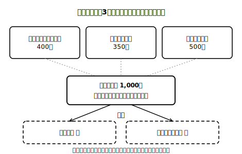

# lesson_01 全部は手に入らない——希少性と選択

## 主概念（1〜2）

1. 希少性：欲しい量に対して、使えるお金・時間・資源には限りがあること
2. 選択：限りがあるからこそ、何かを選び、何かをあきらめること

（見方・考え方：**希少性**）

## 先生の雑談枠（2〜4文）

あおば町の朝市みずき市場では、屋台を出せる場所の数に限りがあるそうです。人気の入り口近くはすぐ埋まってしまうので、売り手たちは順番をゆずり合って使っているのだとか。お金だけでなく、場所にも限りがある——今日は、そんな「限りあるもの」の話から始めます。

## 導入の問い（5分）

架空の町・あおば町の中学生ミナトさんは、今月のおこづかい1,000円（架空の設定）を持って朝市「みずき市場」に来た。買いたいものは3つ：ルポの実のジュース400円、焼きたてパン350円、文房具セット500円。

> 問い：ミナトさんは全部買えるだろうか。買えないとしたら、それはなぜだろう。

## 本文（生徒向け・約200字）

わたしたちの「欲しい」に比べて、使えるお金や時間、材料などの資源には限りがあります。この状態を**希少性**といいます。希少性があるため、人は何かを**選択**し、同時に何かをあきらめています。ミナトさんが1,000円でジュースとパンを買えば、文房具はあきらめることになります。これは個人だけでなく、店や町全体にも当てはまります。限りある資源を「何に、どれだけ使うか」を決める工夫の一つが、次の時間に学ぶ市場という仕組みです。

## 活動（25分）

1. 書き出し：ミナトさんの買い物の組み合わせを全部書き出し、それぞれ「何をあきらめたか」をその隣に書く。
2. 視点の転換：みずき市場でルポの実を売るハルさん（架空の農家）の立場で考える。「今日収穫できたルポの実は40個だけ。誰にどう売るか」——売る側にも希少性があることに気づけるとよい。
3. 発想を広げる：「限りがあるものを配る方法」には他にどんなものがありうるか（先着順・くじ・話し合い・値段…）を、思いつくだけ列挙するに留める（優劣の判定はしない）。

## 確認問題（10分・解答は answer_key_supplement.md）

- Q1：「希少性」とはどのような状態か。「欲しい量」「限り」という言葉を使って説明しなさい。
- Q2：ミナトさんがジュースと文房具を買ったとき、あきらめたものは何か。
- Q3（正解が1つに決まらない問い）：あなた自身が最近行った「選択」を1つ挙げ、そのとき何をあきらめたかを説明しなさい。

## stretch（本文と分離・希望者向け）

- 「時間」にも希少性はあるか。テスト前日の3時間の使い方を例に、お金の場合と同じ考え方が使えるかを試しなさい。
- ハルさんのルポの実が40個ではなく4,000個とれたら、「希少性」はなくなるといえるか。理由も考えなさい。

<!-- gen_nav:nav:start（自動生成・手編集しない） -->

---

[単元の目次](README.md)｜[解答](answer_key_supplement.md)｜[次のレッスン →](lesson_02.md)

<!-- gen_nav:nav:end -->
