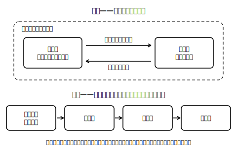
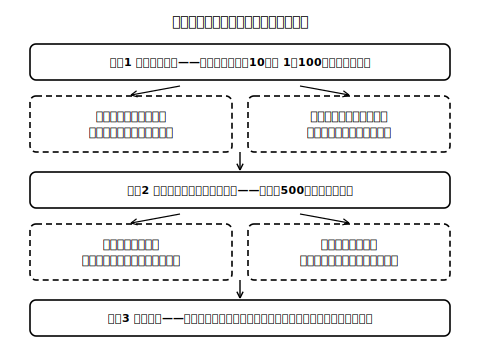

# lesson_02 値段は誰が決めている？——市場と価格の働き

## 主概念（1〜2）

1. 市場：買いたい人と売りたい人が貨幣を通して取引する場で、価格が決まっていくこと
2. 価格の働き：価格の変化が、人々の行動を変えるきっかけになること（※「価格は合図」は分かりやすくするための**比喩**であり、公式な用語ではない）

（見方・考え方：**分業と交換**——貨幣を通した取引）

## 先生の雑談枠（2〜4文）

「値段」と「価格」、ふだんはどちらも同じように使いますが、教科書や資料では「価格」という言い方をよく見かけます。買い物のときは「お値段」、ニュースでは「価格」——場面によって言葉の顔つきが少し変わるのです。今日は、その価格が「誰かが命令したわけでもないのに動く」という不思議を追いかけます。

## 導入の問い（5分）

みずき市場のハルさんは、ルポの実を1個100円（架空の価格）で売っている。ある朝、隣の屋台も、その隣もルポの実を売り始め、夕方には多くの実が売れ残った。翌週、ハルさんは1個80円に下げた。

> 問い：ハルさんに「値下げしなさい」と命令した人はいない。では、なぜ価格は下がったのだろう。

## 本文（生徒向け・約250字）

買いたい人と売りたい人が出会い、**貨幣**を通して商品を取引する場を**市場**といいます。市場では、価格は誰かの命令ではなく、売り手と買い手のやりとりの積み重ねで決まっていきます。価格が動くと、人々の行動も変わります。価格が下がれば、買おうとする量は増えやすく（買う人が増えても、1人が多く買っても）、売ろうとする量は減りやすくなります。このように価格は、限りある資源を何にどれだけ使うかを判断する手がかりになります。これを「価格は合図のような働きをする」とたとえることがあります（正式な用語ではなく、たとえ）。

## 活動（25分）

1. ひとり紙上市場（思考実験）：まず、あなたはルポの実カード10枚を持つ売り手だとする。1枚100円で売り始めて「なかなか売れないとき」「開店してすぐ売り切れそうなとき」のそれぞれで、次にどう値付けし直すかと、その理由を書き出す。次に立場を替えて、あなたは持ち金500円（架空通貨）の買い手だとする。ルポの実が値上がりしたとき・値下がりしたときに、買う量をどう変えるかと、その理由を書き出す。 
2. ふり返り：立場によって、価格が動いたときの行動（売る値付け・買う量）がどう変わったかを自分の言葉でまとめる。売り手と買い手の反応が逆向きになっていることを確かめる。
3. 接続の確認：この取引が成り立つのは、農家・運ぶ人・売る人と役割を分け（**分業**）、貨幣を通して**交換**しているからだと押さえる。

※この活動は、画面版の市場シミュレータ（制作予定）で「値付け→売れ行きの反応」を実際に試せるようになる予定。複数人で行う教室版の進め方は指導者向けノート参照。

## 確認問題（10分・解答は answer_key_supplement.md）

- Q1：市場とはどのような場か。「買いたい人」「売りたい人」「貨幣」の3語を使って説明しなさい。
- Q2：ルポの実の価格が100円から80円に下がったとき、(a)買い手、(b)売り手の行動はそれぞれどう変わりやすいか。
- Q3（正解が1つに決まらない問い）：「価格は合図のようだ」というたとえは、どんな点でうまいたとえだと思うか。逆に、たとえでは表しきれない点はあるか。

## stretch（本文と分離・希望者向け）

- みずき市場に「値札」が一切なかったら、取引はどうなるだろうか。価格が「情報」として果たしている役割を考えなさい。
- ハルさんが1人だけでルポの実の栽培・運搬・販売・道具作りをすべて行う場合と、町の人と分業する場合とで、何が変わるかを比べなさい。

<!-- gen_nav:nav:start（自動生成・手編集しない） -->

---

[← 前のレッスン](lesson_01.md)｜[単元の目次](README.md)｜[解答](answer_key_supplement.md)｜[次のレッスン →](lesson_03.md)

<!-- gen_nav:nav:end -->
