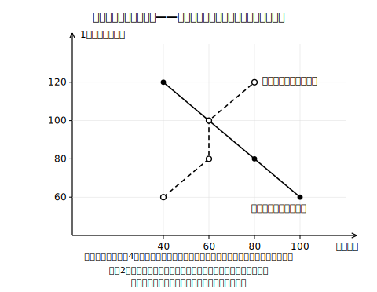
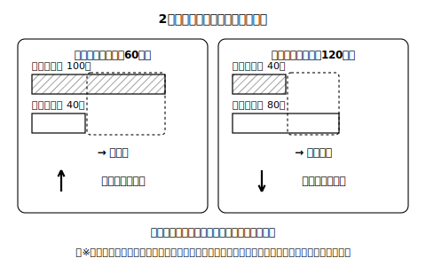

# lesson_03 買いたい量と売りたい量——需要量と供給量

## 主概念（1〜2）

1. 需要量と供給量：ある価格のとき「買いたい量」と「売りたい量」
2. 価格と量の関係：価格が変わると需要量・供給量が変わり、2つの量のズレが価格を動かすこと

（見方・考え方：**希少性**・**分業と交換**）

## 用語についての注記（教師・教材共通）

「需要量・供給量」で説明を進める。「**需要曲線・供給曲線**」という言い方は**多くの教科書や資料で慣用的に使われる表現**（社によって扱いに差がある・教科書本文の確認は未了）であり、本レッスンでも図を指す言葉として使ってよいが、覚えるべき中心は曲線の形ではなく「価格と量の関係」そのものである。

## 先生の雑談枠（2〜4文）

みずき市場のハルさんは、毎晩その日の売れゆきを小さな帳面につけているそうです。帳面に載っているのは「いくらのとき、何個売れたか」——実際に取引が成立した量の記録で、買いたかったのに買えなかった量までは載っていません。今日みなさんが見る調査表（架空）は、そこも聞き取りで調べた、という設定のもの。数字の表から市場の動きが見えてくる回です。

## 導入の問い（5分）

みずき市場のルポの実について、架空の調査表がある（下表・すべて架空データ）。

| 1個の価格 | 町の人が買いたい量（合計） | 売り手が売りたい量（合計） |
|---|---|---|
| 60円 | 100個 | 40個 |
| 80円 | 80個 | 60個 |
| 100円 | 60個 | 60個 |
| 120円 | 40個 | 80個 |

> 問い：この表のとおりなら、価格はどのあたりに落ち着きそうか。理由も考えよう。

## 本文（生徒向け・約250字）

ある価格のときに買い手が買いたいと思う量を**需要量**、売り手が売りたいと思う量を**供給量**といいます。ふつう、価格が下がると需要量は増え、供給量は減ります。価格が上がるとその逆になります。表の60円では、買いたい量100個に対し売りたい量は40個で品不足になり、価格には上がる力が働きます。120円では逆に売れ残りが出て、下がる力が働きます。こうして2つの量のズレが小さくなる方向へ価格は動きます。この表をグラフにした図を、多くの教科書や資料では**需要曲線・供給曲線**と呼んでいます（扱いは社により異なります）。

※価格がこうして動くのは、みずき市場の設定では、売り手が様子を見て自分で値札を書き換えられるからです。誰が・どのように価格を変えられるかは、市場の仕組みによって異なります。

## 活動（25分）

1. 表の読み取り：各価格で「品不足か・売れ残りか・つり合っているか」を表に書き込む。
2. 作図：表をもとに、横軸＝量・縦軸＝価格のグラフに需要量の線と供給量の線をかき、2本が交わる価格を確認する（作図は「表の見える化」として扱い、曲線の形の暗記はさせない）。
3. 言葉で説明：「80円のとき、価格がこのあと動くとしたらどちら向きか」を、需要量・供給量という言葉を使って隣の人に説明する（ひとりで学習しているときは、声に出して説明してみよう。AIに説明を聞いてもらい、伝わったか判定してもらうのもよい）。

## 確認問題（10分・解答は answer_key_supplement.md）

- Q1：価格が60円のとき、需要量と供給量はそれぞれ何個か。また市場では品不足と売れ残りのどちらが起きるか。
- Q2：価格が120円のとき、価格にはどちら向きの力が働くか。「売れ残り」という言葉を使って説明しなさい。
- Q3（正解が1つに決まらない問い）：この表の調査のあと、あおば町でルポの実を使った新しいお菓子が大流行したとする。表の数字はどの列がどう変わりそうか。理由とともに予想しなさい。

## stretch（本文と分離・希望者向け）

- 100円でつり合っているとき、「買いたかったのに買えない人」「売りたかったのに売れない人」はいるか。表から根拠を挙げて答えなさい。
- 需要量の列だけが全価格で20個ずつ増えた新しい表を作り、つり合う価格がどう変わるか調べなさい。

## 次回予告

次の時間は、シミュレータ（interactive_concept.md 参照）を使い、「価格が動くと何が起きるか」を手順を踏んで予測する練習をする。

<!-- gen_nav:nav:start（自動生成・手編集しない） -->

---

[← 前のレッスン](lesson_02.md)｜[単元の目次](README.md)｜[解答](answer_key_supplement.md)｜[次のレッスン →](lesson_04.md)

<!-- gen_nav:nav:end -->
