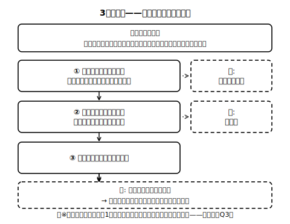

# lesson_04 価格が動くと何が起きる？——変化を手順で予測する

## 主概念（1〜2）

1. 需給の変化と価格・取引量の変化：買いたい量・売りたい量のどちらかが変わると、価格と取引量も変わっていくこと
2. 3問手順型の予測：「どちらの量が→どちら向きに→価格と量はどうなる」の順で考えると、日常の場面にも当てはめやすくなること

（見方・考え方：**効率と公正**の入口——「売れ残り」「品不足」は限りある資源の使い方としてもったいない状態と**言えるか**、という問いまで）

## 先生の雑談枠（2〜4文）

「市場」という言葉、じつは読み方が2つあります。品物が並ぶ実際の場所は「いちば」、取引の仕組み全体を指すときは「しじょう」と読み分けることが多いのです。みずき市場は「いちば」ですが、今日みなさんが予測するのは「しじょう」の動き。同じ字で2つの世界を行き来するのが、この単元のおもしろさです。

## 導入の問い（5分）

あおば町のテレビ番組（架空）でルポの実のジュースが紹介され、「飲んでみたい！」という人が町じゅうで増えた。みずき市場のハルさんは、明日の値付けをどうするか考えている。

> 問い：ルポの実の価格は、このあと上がりそうだろうか、下がりそうだろうか。「なんとなく」ではなく、順番に考えて予測できないだろうか？

## 本文（生徒向け・約240字）

買いたい量（需要量）と売りたい量（供給量）のどちらかが変わると、価格と取引量も変わります。このとき、次の3つの問いを**順番に**考えると、予測しやすくなります。①**どちらの量が**変わる？（買いたい量か、売りたい量か）②**どちら向きに**変わる？（増えるのか、減るのか）③その結果、**価格と取引量はどうなる**？——たとえばジュースの流行では、①買いたい量が、②増えるので、③いまの価格では品不足になり、価格は上がりやすく、取引量も増えやすくなります。この3問の型は、みずき市場以外の場面でも**基本の型**として使えます。

※lesson_03では「価格が変わる→量が変わる」を見た。今回は「価格**以外**のきっかけで量の関係が変わる→価格と取引量が動く」という、向きの違う話であることに注意。また、この型でそのまま予測しにくい場面もある（Q3で考える）。

## 活動（30分・シミュレータ活用回）

> **注記（シミュレータは未同梱）**: 教材シミュレータ「みずき市場のルポの実」は現在未同梱です（interactive_concept.md は設計案）。同梱までは**紙上代替手順**で進めてください——lesson_03 の調査表（価格ごとの買いたい量・売りたい量の表）を使い、場面カードの変化を「その量の列が増える／減る」として自分で書き換え、価格60円などいくつかの価格で品不足・売れ残りのどちらが出るかを表から読み取ります。以下の手順の「シミュレータで再現・表示を見る」は「書き換えた表から読み取る」に読み替えてください。

教材シミュレータ「みずき市場のルポの実」（offline HTML・詳細は interactive_concept.md）を使う。この回から変数B（流行）・変数C（収穫のできぐあい）が解放される。

1. **予測してから動かす**：場面カード（すべて架空。流行・収穫・新しい売り手の参入・保存技術の向上・となり町の祭り の5場面）を1枚引き、シミュレータを動かす**前に**3問手順（①どちらの量が ②どちら向きに ③価格と量は）をワークシートに書く。
2. **見て確かめる**：シミュレータで同じ変化を再現し、町のビュー（品不足／売れ残り／落ち着き先）と数の表示を自分の予測と見比べる。予測と違ったら、3問のどこでずれたかを特定する。
3. **1回1変数の約束**：一度に動かす変数は1つだけ。2つ同時に動かすと「どちらの量が」の切り分けができなくなるためだと確認する。
4. ふり返り：売れ残りや品不足が出ている画面を見て、「この状態は、限りある実や労力の使い方として、もったいないと言えるだろうか」を考え、そう言える／言えないと思った理由も一言メモする（→ lesson_05 への橋）。

※グラフ表示（需要曲線・供給曲線）は補助。この呼び名は**多くの教科書や資料で使われる慣用的な言い方**（教科書によって扱いは異なる）で、折りたたみを開いた人だけが確認すればよい。

## 確認問題（10分・解答は answer_key_L04-06.md）

- Q1：あおば町で「ルポの実の保存技術が向上し、売り手が遠くの畑からも実を運べるようになった」（架空）。3問手順（①どちらの量が ②どちら向きに ③価格と取引量はどうなる）で予測しなさい。
- Q2：価格60円では、日照りの前から品不足が表示されている（lesson_03 の表のとおり）。シミュレータで「日照りで収穫減」をONにしたとき、価格60円のままだと、品不足の個数はどう変わると考えられるか。「増える」「減る」「変わらない」から選び、理由を書きなさい。
- Q3（正解が1つに決まらない問い）：3問手順を使っても予測がむずかしいのは、どんな場面だと思うか。自分で場面を1つ考えて（架空でよい）、むずかしい理由を説明しなさい。

## stretch（本文と分離・希望者向け）

- 「買いたい量が増える」と「売りたい量が減る」は、どちらも価格を上げる向きに働く。では価格の上がり方に違いは出るだろうか。シミュレータで変数Bと変数Cを（別々に）試して、取引量の動きの違いに注目して報告しなさい。
- 3問手順の①の前に、じつは「隠れた0問目」がある——「そもそも何がきっかけで変わったのか？」。場面カード5枚のきっかけを「買い手側の事情」「売り手側の事情」に仕分けしてみよう。

<!-- gen_nav:nav:start（自動生成・手編集しない） -->

---

[← 前のレッスン](lesson_03.md)｜[単元の目次](README.md)｜[解答](answer_key_L04-06.md)｜[次のレッスン →](lesson_05.md)

<!-- gen_nav:nav:end -->
