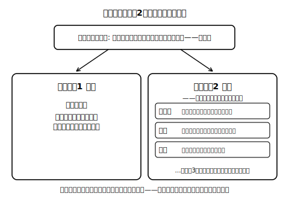

# lesson_05 その決まり方は「効率」か「公正」か

## 主概念（1〜2）

1. 効率：無駄を省くこと（より少ない資源でより大きな成果を得ること）
2. 公正：**手続き**の公正（決め方はみんなが参加できたか）・**機会**の公正（チャンスは等しく開かれていたか）・**結果**の公正（行き渡り方に偏りはないか）など、意味の異なる複数のものさしがあること（3つはその例であり、すべてではない）

（見方・考え方：**効率と公正**・**対立と合意**）

## 先生の雑談枠（2〜4文）

あおば町の子どもたちの間では、みずき市場の開店の合図は「ハルさんのやかんの湯気」だと言われています。ハルさんが屋台でお茶をわかし始めると、他の売り手もつられて店を開けるのだとか。ルールで決めたわけでもないのに、なんとなくみんなの動きがそろっていく——市場には、そういう不思議な調子あわせがあちこちにあります。

## 導入の問い（5分）

lesson_04 の日照りの場面（架空）を思い出そう。収穫が減り、ルポの実の価格は上がった。売り切れも売れ残りも出なかったが、いつもより買える人は限られた。あおば町の集会で、ある人は「無駄が出なかったのだから、よい決まり方だ」と言い、別の人は「本当にそれでよかったのか」と言った。

> 問い：この2人は、同じ出来事を**違うものさし**で測っているのではないだろうか？　それぞれのものさしに名前を付けるとしたら？

## 本文（生徒向け・約250字）

物事の決まり方を評価するとき、社会科では**効率**と**公正**の2つの見方を使います。効率とは、無駄を省くこと——より少ない資源でより大きな成果を得ることです。売れ残りや品不足が減ることは効率の一面ですが、価格が上がって買えなくなった人をどう見るかは公正の問いです。公正のものさしは複数あります。決め方にみんなが参加できたかという**手続き**の公正、チャンスが等しく開かれていたかという**機会**の公正、行き渡り方に偏りがないかという**結果**の公正などです。同じ価格の動きでも、どのものさしで測るかによって評価は変わりえます。

## 活動（25分）

1. **ものさし仕分け**：あおば町の住民の発言（すべて架空・6つ）を仕分けする。例——「くじ引きで買える人を決めるのはどうか」「先に並んだ人から買えるのは当然だ」「値上げの理由をハルさんはみんなに説明した」「遠くに住む人は市場に来ること自体が大変だ」など。各発言が「効率」「手続きの公正」「機会の公正」「結果の公正」のどれに最も近いかを自分で仕分けし、**1つの発言が複数に当てはまりうる**ことも記録する。
2. **立場を替えて言い直す**：自分が最初に選んだ発言と反対側のものさしに立って、同じ場面を1文で言い直す。「どちらが正しいか」ではなく「どちらのものさしか」を言い当てる練習だと確認する。
3. 接続の確認：価格の上下そのものは、それだけでは「よい／わるい」を決めない。評価には必ずものさしの選択が入り、ものさしが違う人どうしの**対立と合意**の問題になる、と押さえる。だからこそ、対立をこえて合意をつくるには、まず「いま、どのものさしの話をしているのか」をそろえることが出発点になる、とまとめる。

## 確認問題（10分・解答は answer_key_L04-06.md）

- Q1：「効率」の意味を、「資源」「成果」の2語を使って1文で説明しなさい。
- Q2：次の(a)〜(c)は、公正のどのものさし（手続き・機会・結果）に主に関わる指摘か。（a）「決める話し合いに、買い手の代表が入っていなかった」（b）「新しく売り手として市場に加わりたい人が、場所を借りられなかった」（c）「実がほとんど一部の家にだけ行き渡った」
- Q3（正解が1つに決まらない問い）：日照りの場面（架空）で価格が上がったことについて、「効率」の見方からの評価と「公正」の見方からの評価を1つずつ書き、そのうえで自分は2つの見方をどう組み合わせて考えるかを説明しなさい。
- Q4（正解が1つに決まらない問い）：「公正」のものさしが1つではなく複数（この時間は手続き・機会・結果の3つを例に学んだ）あることで、話し合いはやりにくくなるだろうか、それともやりやすくなるだろうか。理由とともに答えなさい。

## stretch（本文と分離・希望者向け）

- みずき市場で「1人3個まで」という個数制限（架空のルール）を売り手たちが自主的に決めたとする。このルールを効率・手続き・機会・結果の4つのものさしそれぞれで点検すると、見え方はどう変わるか。
- 「効率」と「公正」は、いつも対立するとは限らない。両方が同時に良くなる場面を、あおば町を舞台に1つ考えてみよう。

<!-- gen_nav:nav:start（自動生成・手編集しない） -->

---

[← 前のレッスン](lesson_04.md)｜[単元の目次](README.md)｜[解答](answer_key_L04-06.md)｜[次のレッスン →](lesson_06.md)

<!-- gen_nav:nav:end -->
