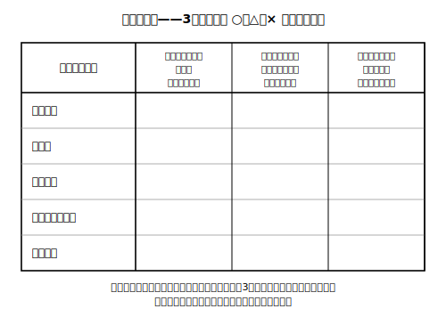

# lesson_06 市場に委ねにくいものがある——次の学習への橋

## 主概念（1〜2）

1. 市場に委ねにくい領域がある、という**構造の入口**：市場の価格の働きがうまく機能しにくい性質をもつ財・サービスが存在すること（※委ねるべきか否かの**是非の判断はこのレッスンでは行わない**）

（見方・考え方：**対立と合意**——次単元・高校「公共」への橋）

## 先生の雑談枠（2〜4文）

あおば町の地図を描いた人によると、町でいちばん長い「建物」は、じつは地面の下にあるそうです。町のすみずみまで水を届ける水道管で、つなげると町を何周もする長さになるのだとか。市場の屋台は毎朝すぐ開けますが、この地下の「建物」は一朝一夕には作れません——今日はそんな話です。

## 導入の問い（5分）

みずき市場では、ルポの実の売り手が増えたり減ったり、価格が上がったり下がったりして、実は町に行き渡ってきた。では、あおば町の**水道の水**はどうだろう。

> 問い：ルポの実と水道の水。「売り手」「買わないという選択」「価格が動いたときの反応」の3点で比べると、どんな違いが見つかるだろうか？

## 本文（生徒向け・約250字）

これまでのみずき市場の例では、売り手が増えたり減ったりでき、買い手も「買わない」を選べました。この条件が成り立ちにくいものもあります。あおば町の水道（架空の例）には、①町じゅうの管をもう1組つくって競争するのが難しい、②生活に不可欠で「高いから買わない」を選びにくい、③使う人が増えても新しい売り手がすぐには現れない、という性質があります。こうした財やサービスの供給と対価の決め方は、市場の価格の働きだけに委ねにくく、社会で決め方を考える**対立と合意**の問題として扱われます。続きは次の学習で学びます。

## 活動（25分）

1. **性質しらべ**：あおば町の財・サービス（すべて架空・5つ）——「ルポの実」「町の橋」「水道の水」「屋台の飾りひも」「夜の街灯」——を、次の3つの観点で○△×判定する（表に書き出す）。（ア）売り手は自由に増えられるか（イ）買い手は「買わない」を選びやすいか（ウ）使う人を特定の人に限定しやすいか。 
2. **並べ替え**：判定結果をもとに、「市場の価格の働きが機能しやすい」〜「機能しにくい」の一直線上に5つを並べ、その並び順にした理由を書き出す。並び順は人によって違ってよい（境目は一つに決まらない）。（ア）〜（ウ）は性質の異なる観点なので、1本の線に並べきれないと感じたら、並べきれない理由を書き出す——それも立派な答えである。
3. 接続の確認：機能しにくい側の財・サービスについて、「では誰が・どのように供給し、対価をどう決めるのがよいか」という問いは、複数の立場からの**多面的・多角的な考察**が必要な問いであり、この単元では**問いを立てるところまで**にとどめて次の学習へ渡す、と押さえる。その決め方には、話し合いのほかにも様々な方法や組み合わせがありうることにも触れる。

## 確認問題（10分・解答は answer_key_L04-06.md）

- Q1：あおば町の水道（架空の例）が「市場の価格の働きに委ねにくい」とされる性質を、本文の①〜③から2つ選んで自分の言葉で説明しなさい。
- Q2：「夜の街灯」は、使う人を特定の人に限定することが難しい。このことは、街灯を市場の取引だけで供給しようとするとき、どんな困りごとを生むと考えられるか。仕組みの面から説明しなさい。
- Q3（正解が1つに決まらない問い）：あおば町の水道の対価の決め方について、立場カード（利用する住民・水道で働く人・町の会計を預かる人・これから生まれる世代の代弁者）から2つを選び、それぞれの立場が大事にしそうな点を挙げなさい。そのうえで、両者の間で**対立しそうな点**と**合意の糸口になりそうな点**を1つずつ書きなさい（どの決め方が正しいかを答える問題ではない）。

## stretch（本文と分離・希望者向け）

- 活動でつくった「機能しやすい〜機能しにくい」の一直線の**真ん中あたり**に来たカードはどれか。真ん中に来る財・サービスこそ、社会で意見が分かれやすいのはなぜかを考えてみよう。
- 「町の橋」を渡るたびに料金を取る仕組み（架空）を想像してみる。技術的にできるかどうかと、それがよい決め方かどうかは別の問いである。2つの問いを区別して、それぞれ何を調べれば考えを深められるかをメモしなさい。

## 単元のまとめ（5分）

単元を貫く問い——「あおば町のみずき市場で、ルポの実の値段が動くとき、町の人々の行動はどう変わるだろうか。そして、値段だけでは決められないものはあるだろうか。」——に、いまの自分の言葉で3〜4文の答えを書いて単元を閉じる。前半（L1〜L4）と後半（L5〜L6）の両方の学びが入っていれば、答えの形は一人ひとり違ってよい。

<!-- gen_nav:nav:start（自動生成・手編集しない） -->

---

[← 前のレッスン](lesson_05.md)｜[単元の目次](README.md)｜[解答](answer_key_L04-06.md)

<!-- gen_nav:nav:end -->
